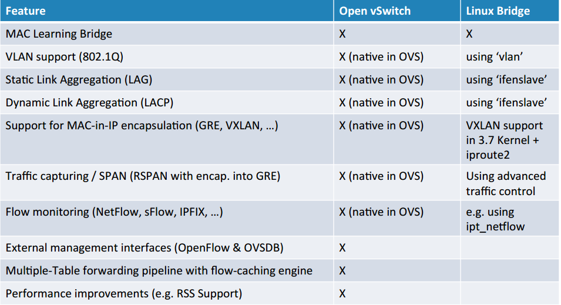

# So sánh giữa Open vSwitch và Linux bridge
- Linux bridge (LB) là 1 network stack được tích hợp sẵn trong nhân của linux. LB khá mạnh mẽ và mềm dẻo với nhiều tính năng của 1 switch layer 2, có thể dùng để truyền thông giữa nhiều máy ảo trong môi trường ảo hóa

- Openvswitch (OVS) được sử dụng trong môi trường ảo hóa nhiều máy chủ. Môi trường này thường có sự linh hoạt và có trạng thái thay đổi liên tục:
    + Trạng thái linh động: OVS thích hợp cho việc migrate, di chuyển máy ảo đồng thời di chuyển cả các trạng thái về mạng như MAC table, forwarding state, ACL, QoS...

    + Phản hồi nhanh đối với những thay đổi của mạng. OVS cung cấp cơ chế để kiểm soát và phản hồi với những thay đổi của hệ thống. Điển hình là netflow, sflow, openflow và OVSDB (ovs database management protocol)

- So sánh tính năng giữa openvswitch và Linux bridge:

- Có thể thấy Openvswitch sở hữu 1 số lượng lớn các tính năng, khá mạnh mẽ với sự hỗ trợ của nhiều cơ chế quản lý, trong khi đó Linux bridge với số lượng tính năng ít hơn, 1 số tính năng muốn sử dụng phải cài đặt thêm các gói hỗ trợ

### Open vSwitch:
- Ưu điểm: ác tính năng tích hợp nhiều và đa dạng, kế thừa từ linux bridge. OVS hỗ trợ ảo hóa lên tới layer4. Được sự hỗ trợ mạnh mẽ từ cộng đồng. Hỗ trợ xây dựng overlay network

- Nhược điểm: Phức tạp, gây ra xung đột luồng dữ liệu

### Linux bridge
- Ưu điểm:
    + Các tính năng chính của switch layer được tích hợp sẵn trong nhân. Có được sự ổn định và tin cậy, dễ dàng trong việc troubleshoot

    + Less moving parts: được hiểu như LB hoạt động 1 cách đơn giản, các gói tin được forward nhanh chóng

- Nhược điểm:
    + Để sử dụng ở mức user space phải cài đặt thêm các gói. VD vlan, ifenslave. Không hỗ trợ openflow và các giao thức điều khiển khác

    + Không có được sự linh hoạt

