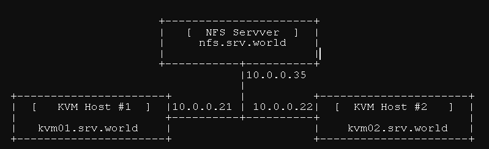

# 1. Live migrate


1.1. Trên NFS server

Tạo thư mục shared giữa 2 host KVM

```sh
# Cài nfs server cho server nfs
sudo apt install -y nfs-kernel-server

# Tạo thư mục shared và cấp quyền
sudo mkdir -p /var/kvm/images
sudo chown -R libvirt-qemu:kvm /var/kvm/images
sudo chmod 770 /var/kvm/images
```

Export NFS
```sh
sudo nano /etc/exports

# Thêm dòng này vào 
/var/kvm/images 10.0.0.0/8(rw,sync,no_subtree_check,no_root_squash)

# Áp dụng cấu hình
sudo exportfs -rav
sudo systemctl restart nfs-kernel-server

```

### 1.2. Trên 2 host KVM

Mount đến thư mục dùng chung
```sh
sudo mkdir -p /var/kvm/images
sudo mount -t 10.0.0.35:/var/kvm/images /var/kvm/images

# Thêm vào /etc/fstab để boot lên tự mount
echo "10.0.0.35:/var/kvm/images /var/kvm/images nfs defaults,_netdev 0 0" | sudo tee -a /etc/fstab
```

Tạo storage pool cho libvirt trỏ vào NFS share trên cả 2 host
```sh
# tạo storage pool kiểu "dir" trỏ vào /var/kvm/images
sudo virsh pool-define-as kvm-images dir - - - - "/var/kvm/images"
sudo virsh pool-autostart kvm-images
sudo virsh pool-start kvm-images
sudo virsh pool-list --all
```

Chuẩn bị SSH giữa 2 KVM host
```sh
# KVM1
sudo -i  # vào root
ssh-keygen   # enter enter enter
ssh-copy-id root@10.0.0.22   # copy key sang kvm02

# KVM2
sudo -i
ssh-keygen
ssh-copy-id root@10.0.0.21
```

Tạo VM trên shared storage (kvm01)
```sh
sudo virt-install \
  --name ubuntu2204-1 \
  --ram 2048 \
  --vcpus 2 \
  --disk path=/var/kvm/images/ubuntu2204.qcow2,size=4,format=qcow2 \
  --cdrom /var/lib/libvirt/images/ubuntu-22.04.2-live-server-amd64.iso \
  --os-variant ubuntu22.04 \
  --network bridge=br0 \
  --graphics none
```

Chỉnh cache của disk về `none`
```sh
<disk type='file' device='disk'>
  <driver name='qemu' type='qcow2' cache='none'/>
  <source file='/var/kvm/images/ubuntu2204.qcow2'/>
  ...
</disk>
```

Live migrate
```sh
sudo virsh migrate --live ubuntu2204 qemu+ssh://root@10.0.0.22/system
```

# 2. Off migrate
Export cấu hình VM
```sh
virsh dumpxml <vm_name> > vm_config.xml
```

Copy file disk của VM sang host kvm khác
```sh
scp /var/lib/libvirt/images/<vm_disk>.qcow2 user@destination:/var/lib/libvirt/images/
```

Copy file cấu hình của VM sang host kvm khác
```sh
scp vm_config.xml user@destination:/tmp/
```

Định nghĩa vm trên host kvm đích
```sh
virsh define /tmp/vm_config.xml
```

Khởi động vm
```sh
virsh start <vm_name>
```