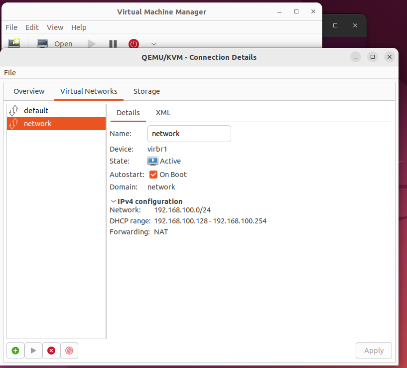

# 1. Tổng quan
- Virt-manager là một tiện ích đồ họa hỗ trợ quản trị viên và người dùng quản lý KVM, Xen virtual machine, và LXC

- Phục vụ cho cả người dùng mới và người đã có kinh nghiệm

# 2. Cách sử dụng
Tạo máy ảo:
- Download một file ISO hoặc image OS mà bạn muốn cài đặt.

- Click vào File => New virtual machine

- Điền các thông số cho máy ảo, rồi chọn Forward. Cuối cùng chọn Finish và click Install virtual machine.

Làm việc với máy ảo:
- Click vào máy ảo cần xem thông tin, một cửa số hiện ra với các thông số cấu hình cho máy ảo, có thể chọn và sửa cho từng thông số tùy ý mình

- Có thể tùy chỉnh: Run, Pause, shutdown, reboot, forceoff, fullscreen hoặc console và một số thao tác tới máy ảo

Quản lý mạng ảo:
- Quản lý mạng ảo: trên màn hình chính của virt-manager : chọn Edit => Connection details => Virtual network

- Tại đây có thể thêm, stop, start, xóa các mạng ảo như trong phần chế độ mạng ảo

