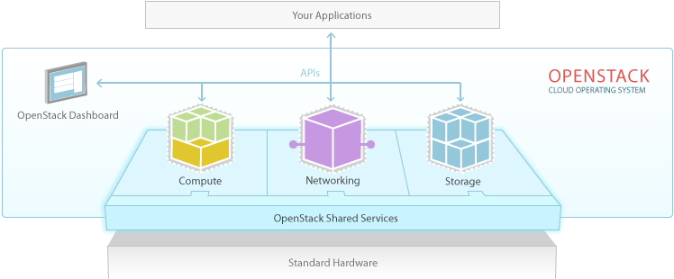

# 1. Openstack là gì
- OpenStack là một nền tảng mã nguồn mở dùng để xây dựng và quản lý hạ tầng điện toán đám mây theo mô hình IaaS, giúp doanh nghiệp tự chủ trong việc triển khai và tự động hóa tài nguyên

- OpenStack cho phép doanh nghiệp triển khai, tự động hóa và kiểm soát tài nguyên CNTT như máy chủ ảo, lưu trữ, mạng và hệ thống bảo mật trên máy chủ vật lý có sẵn

- Nền tảng này hỗ trợ mở rộng linh hoạt, tiết kiệm chi phí, dễ cấu hình, giúp nâng cao hiệu suất vận hành hạ tầng và tối ưu quản trị

- Vai trò của OpenStack trong điện toán đám mây:
    + Cung cấp nền tảng IaaS linh hoạt: OpenStack cho phép doanh nghiệp triển khai hạ tầng điện toán đám mây dạng dịch vụ, dễ dàng tạo, quản lý, phân phối các tài nguyên như máy chủ ảo, lưu trữ, mạng trên nhiều thiết bị vật lý sẵn có

    + Tự chủ hóa hạ tầng cloud: Nhờ mã nguồn mở, doanh nghiệp có thể tự chủ xây dựng và kiểm soát hoàn toàn môi trường cloud riêng, không bị khóa phụ thuộc vào các nhà cung cấp lớn như AWS, Azure, Google Cloud

    + Nền tảng phát triển dịch vụ, hosting, datacenter: OpenStack là giải pháp chủ đạo cho các nhà cung cấp dịch vụ hosting, datacenter, giúp dễ dàng xây dựng gói dịch vụ VPS/Cloud Server, lưu trữ hoặc nhiều giải pháp điện toán đám mây theo yêu cầu khách hàng

# 2. Kiến trúc của Openstack
### 2.1. Các thành phần cốt lõi của OpenStack
- Nova (Compute): Nova là thành phần chịu trách nhiệm quản lý tài nguyên tính toán trong hệ thống OpenStack, cho phép khởi tạo, vận hành, tạm dừng hoặc xóa các máy chủ ảo. Đồng thời, Nova hỗ trợ điều phối và cân bằng tài nguyên giữa các máy vật lý, đảm bảo khả năng mở rộng và linh hoạt cho môi trường đám mây

- Swift (Object Storage): Swift cung cấp dịch vụ lưu trữ đối tượng có khả năng mở rộng cao, phù hợp cho các dữ liệu phi cấu trúc như hình ảnh, video, tài liệu hoặc backup. Dữ liệu trong Swift được phân phối và nhân bản trên nhiều node, giúp tối ưu khả năng truy xuất và an toàn dữ liệu

- Cinder (Block Storage): Cinder đảm nhận vai trò cung cấp lưu trữ dạng block cho máy chủ ảo hoặc dịch vụ khác trong hệ thống. Người dùng có thể tạo, gắn, tách hoặc mở rộng các ổ đĩa ảo cho instance, tương tự như một ổ cứng vật lý, rất hữu ích cho các ứng dụng đòi hỏi hiệu năng và lưu trữ lớn

- Neutron (Networking): Neutron giúp quản lý, cấu hình các dịch vụ mạng trong OpenStack, cho phép tạo các mạng ảo, cấp phát địa chỉ IP, cấu hình tường lửa và cân bằng tải. Nhờ Neutron, các kết nối mạng giữa các instance, dịch vụ, và với mạng ngoài đều được kiểm soát và tùy biến linh hoạt

- Glance (Image): Glance cung cấp chức năng quản lý các image máy ảo, cho phép người dùng lưu trữ, chia sẻ và tái sử dụng các template hệ điều hành để triển khai máy chủ ảo một cách nhanh chóng và nhất quán trên toàn hệ thống

- Keystone (Identity): Keystone là trung tâm xác thực và phân quyền trong OpenStack, giúp quản lý danh tính người dùng, nhóm, vai trò và quyền truy cập đến từng tài nguyên hay dịch vụ, đảm bảo hoạt động bảo mật và kiểm soát toàn diện

- Horizon (Dashboard): Horizon là giao diện quản trị đồ họa dựa trên web của OpenStack, hỗ trợ người dùng và quản trị viên dễ dàng thao tác, kiểm tra trạng thái tài nguyên, triển khai dịch vụ, cấu hình hệ thống mà không cần sử dụng dòng lệnh

### 2.2. Kiến trúc Openstack

- Tầg ứng dụng (Your Application) : Các ứng dụng/phần mềm sử dụng OpenStack

- Tầng Hypervisor (Standard Hardware) : Phần ứng máy chủ đã được ảo hóa để chia sẻ cho người dùng

- Dịch vụ OpenStack (Openstack Shared Services) : Các thành phần cơ bản như Dashboard, Compute, Networking, API, Storage

