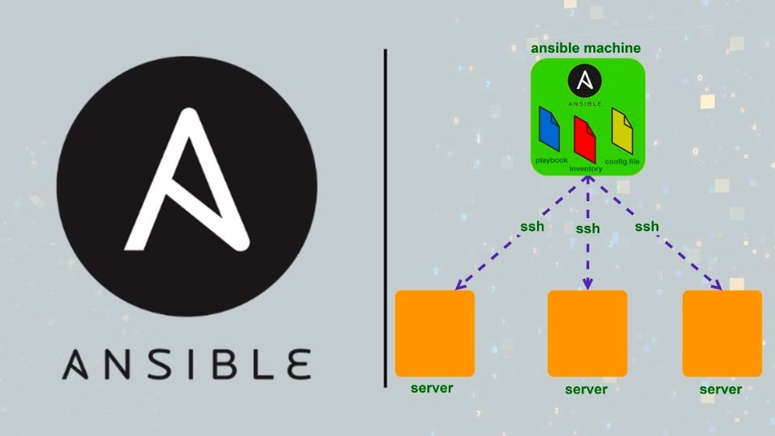

# Ansible là gì?
Ansible là một trong số các công cụ quản lý cấu hình hiện đại, tạo điều kiện cho công việc cài đặt, quản lý và bảo trì server từ xa.

Ansible có thiết kế tối giản, giúp người dùng cài đặt và chạy rất nhanh chóng. Người dùng sẽ viết các tập lệnh cấp phép Ansible trong YAML - một tiêu chuẩn tuần tự hoá dữ liệu rất thân thiện với người dùng và chúng không bị ràng buộc với ngôn ngữ lập trình nào.

Chính vì thế, người dùng có thể tạo ra những tập lệnh cấp phép phức tạp một cách trực quan hơn so với những công cụ còn lại trong cùng một danh mục.

Trong phần mềm Ansible có một máy điều khiển được cài đặt tích hợp và giao tiếp với các nút thông qua SSH tiêu chuẩn. Ansible là một công cụ quản lý cấu hình và tự động hoá, gói gọn tất cả những tính năng phổ biến có trong những công cụ khác cùng loại, đồng thời vẫn đáp ứng được tính đơn giản và hiệu suất.

Việc dùng các công cụ quản lý cấu hình cho server sẽ cho phép bạn:
- Sử dụng hệ thống kiểm soát version trong việc quản lý mọi thay đổi của cơ sở hạ tầng.

- Sử dụng lại những tập lệnh cấp phép cho nhiều môi trường server như phát triển, thử nghiệm và production.

- Làm việc trong môi trường phát triển chuẩn hoá bằng việc chia sẻ những tập lệnh cấp phép.

- Hợp lý hoá quá trình sao chép server, tạo điều kiện khôi phục những lỗi nghiêm trọng. 

- Cung cấp cách kiểm soát từ một đến hàng trăm server từ một vị trí tập trung, giúp cải thiện đáng kể tính hiệu quả và toàn vẹn của cơ sở hạ tầng server.

# Kiến trúc của Ansible
Ansible sử dụng kiến trúc agentless không cần agent để giao tiếp với máy khác.

Cơ bản nhất là giao tiếp nhờ vào giao thức SSH trên Linux, WinRM trên Windows hoặc qua chính API mà thiết bị đó cung cấp.

Ansible có thể giao tiếp được với rất nhiều OS, platform và thiết bị như VMware, Ubuntu, Windows, CentOS, AWS, Azure, các thiết bị mạng Cisco và Juniper,... và hoàn toàn không cần agent khi giao tiếp.

# Ứng dụng của Ansible 
Provisioning: Khởi tạo VM, container hàng loạt trên cloud dựa vào API - OpenStack, Azure, AWS, Google Cloud,...

Configuration Management: Quản lý cấu hình tập trung các dịch vụ và không cần phải tốn công chỉnh sửa cấu hình trên từng server.

Application Deployment: Deploy ứng dụng hàng loạt, hỗ trợ quản lý hiệu quả vòng đời của ứng dụng từ giai đoạn dev đến production.

Security & Compliance: Quản lý đồng bộ các chính sách về an toàn thông tin trên nhiều sản phẩm và môi trường khác nhau, chẳng hạn như deploy policy hoặc cấu hình firewall hàng loạt trên nhiều server,...

# Thuật ngữ cơ bản khi sử dụng Ansible
Để có thể hiểu và áp dụng Ansible hiệu quả, bạn cần nắm rõ những thuật ngữ sau:
- Controller Machine: Là máy cài Ansible, chịu trách nhiệm về việc quản lý, điều khiển và gửi task đến các máy con cần quản lý.

- Inventory: Là file chứa thông tin các server cần quản lý. File này thường nằm ở đường dẫn /etc/ansible/hosts.

- Playbook: Là file chứa các task được ghi dưới định dạng YAML. Máy controller sẽ đọc các task này trong playbook và đẩy các lệnh thực thi tương ứng bằng Python xuống các máy con.

- Task: Là một block ghi lại các tác vụ cần thực hiện trong playbook và những thông số liên quan.

- Module: Có rất nhiều module khác nhau trong Ansible, cụ thể là hơn 2000 module để thực hiện những tác vụ khác nhau. Bạn cũng có thể tự viết thêm các module của mình nếu có nhu cầu. Một số module thường dùng cho các thao tác đơn giản như: Files, System, Cloud, Commands, Windows,... 

- Role: Là một tập playbook đã được định nghĩa để thực hiện một tác vụ nhất định. Nếu như bạn có nhiều server, mỗi server sẽ thực hiện các task riêng biệt. Lúc này, nếu bạn viết tất cả vào cùng chung một file playbook thì rất khó quản lý. Do đó role giúp bạn phân chia khu vực với những nhiệm vụ riêng biệt.

- Play: Là quá trình thực thi một playbook.

- Facts: Là thông tin của các máy được Ansible điều khiển, như OS, network, system,...

- Handlers: Được dùng để kích hoạt các thay đổi của dịch vụ start và stop service.

- Variables: Được dùng để lưu trữ những giá trị và có thể thay đổi được chúng. Để khai báo biến, bạn chỉ cần dùng thuộc tính vars đã được cung cấp sẵn bởi Ansible.

- Conditions: Ansible cho phép người dùng điều hướng lệnh chạy hoặc giới hạn phạm vi để thực hiện một câu lệnh nào đó. Nói cách khác, khi thoả mãn điều kiện thì câu lệnh mới được thực thi. Ngoài ra, Ansible cũng cung cấp thuộc tính Register - một thuộc tính giúp nhận câu trả lời từ một câu lệnh. Sau đó, chúng ta có thể sử dụng kết quả này để chạy những câu lệnh sau.

