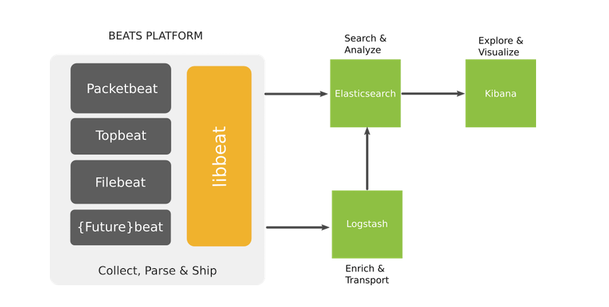

# 1. Beats là gì?
Beats là những data shipper mã nguồn mở mà ta sẽ cài đặt như các agent trên các server mà chúng ta cần thu thập các sự kiện để gửi các kiểu dữ liệu khác nhau tới Elasticsearch. Beats có thể gửi dữ liệu trực tiếp tới Elasticsearch hay tới Logstash.

Beats là một platform trong đó có các project nhỏ sinh ra thực hiện trên từng loại dữ liệu nhất định.

ELK cần sử dụng các “beat” để làm shipper giúp gửi các loại dữ liệu từ client tới Server.

Các beat index pattern cần được cài đặt trên cả ELK server và các client. Trên ELK server, các beat sẽ kết hợp với các thành phần để lọc dữ liệu, đánh chỉ mục, hiển thị.

Một số beats pattern thường được dùng là:
- Packetbeat : Thực hiện gửi dữ liệu được capture từ các port về server.

- Topbeat : Như là một monitor agent, giúp chúng ta có thể thu thập các thông tin về phần cứng như là : CPU, RAM,…

- Filebeat : Giúp vận chuyển các log từ client về server.

- Winlogbeat : Giúp vận chuyển event log từ các client là máy OS Windows.

- Metricbeat : Thu thập các dữ liệu từ hệ điều hành, các dịch vụ như : Apache, HAProxy, MongoDB, Nginx,….

Trong các beats pattern được kể ở trên thì filebeat thường được ưu tiên sử dụng tuy nhiên filebeat vẫn còn một số hạn chế cần lưu ý khi sử dụng như:
- Khó khăn đối với người mới sử dụng cú pháp YAML.

- Nếu cấu hình quá nhiều file log cần đẩy về thì File filebeat registry sẽ phình to rất nhanh do cần dung lượng để lưu trữ từng trạng thái của từng dòng log(dòng log đã được gửi đi hay chưa).

- Không nên cấu hình filebeat quét các filelog nhỏ hơn 1s bởi vì điều anfy sẽ khiến cho filebeat chiếm CPU một lượng đáng kể.

# 2. Filebeat làm việc như thế nào
Khi khởi động filebeat, nó sẽ khởi chạy một hay nhiều prospector, sẽ tìm kiếm các đường dẫn của tập tin tin mà ta đã khai báo.

Với mỗi môt tập tin log mà prospector tìm thấy được, Filebeat sẽ khởi chạy một harvester.

Mỗi một harvester đọc một tập tin log, và gửi các bản tin log này khi có dữ liệu mới tới spooler. 

Spooler là nơi tổng hợp các sự kiện và gửi dữ liệu đã tổng hợp được tới output mà ta đã cấu hình trên Filebeat.

Cấu trúc bên trong filebeat:

