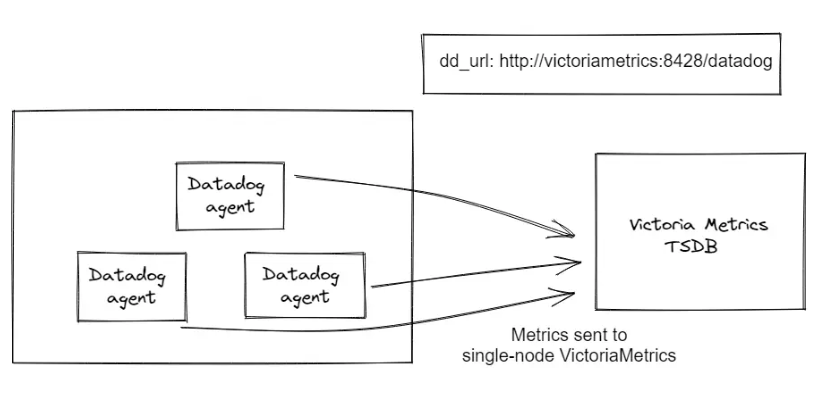
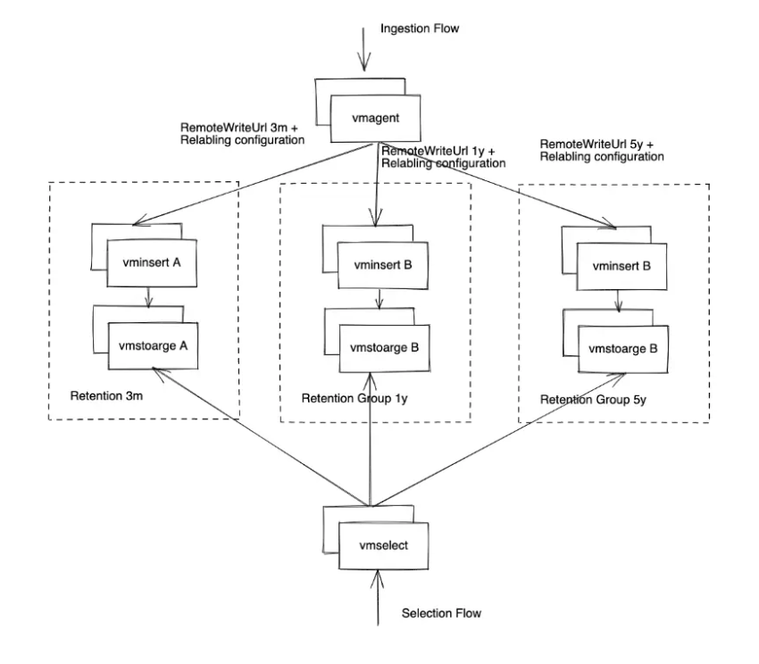

# 1. Victoria Metrics
VictoriaMetrics là một hệ thống lưu trữ và phân tích dữ liệu thời gian thực (time-series database) được thiết kế với mục tiêu cung cấp khả năng mở rộng tốt, hiệu suất cao và tối ưu hóa cho các tác vụ giám sát dữ liệu và phân tích.

Khả năng xử lý dữ liệu lớn và khả năng mở rộng ngang (horizontal scaling) giúp VictoriaMetrics trở thành một lựa chọn lý tưởng cho các ứng dụng giám sát và phân tích dữ liệu trong môi trường đám mây và on-premise.

## 1.1. Những điểm nổi bật của VictoriaMetrics

Hiệu suất cao: VictoriaMetrics được tối ưu hóa để xử lý hàng triệu điểm dữ liệu mỗi giây mà không làm giảm hiệu suất.

Dung lượng lưu trữ tiết kiệm: Hệ thống này sử dụng định dạng nén dữ liệu hiệu quả, giúp tiết kiệm không gian lưu trữ trong khi vẫn đảm bảo dễ dàng truy cập và phân tích.

Khả năng mở rộng linh hoạt: Người dùng có thể mở rộng chiều dọc hoặc chiều ngang của hệ thông mà không gặp phải sự khó khăn nào trong việc duy trì tính khả dụng và hiệu suất.

Tính tương thích cao: VictoriaMetrics tương thích với Prometheus, cho phép người dùng dễ dàng chuyển đổi sang hoặc sử dụng song song cùng với Prometheus.

Hỗ trợ nhiều ngôn ngữ truy vấn: Hệ thống hỗ trợ ngôn ngữ truy vấn linh hoạt và mạnh mẽ, tương tự như SQL, giúp người dùng thực hiện các truy vấn phức tạp một cách dễ dàng.

## 1.2. Kiến trúc và hoạt động

VictoriaMetrics mang trong mình một kiến trúc đơn giản nhưng mạnh mẽ:

- Tầng lưu trữ: Dữ liệu được lưu trữ dưới dạng hàng triệu điểm dữ liệu thời gian thực bằng định dạng nén. Kiến trúc này cho phép hệ thống cung cấp lưu trữ hiệu quả mà không cần thêm nhiều tài nguyên.

- Tầng truy vấn: Hệ thống hỗ trợ truy vấn mạnh từ cách đơn giản đến phức tạp, cho phép người dùng dễ dàng tìm kiếm và phân tích dữ liệu theo nhiều tiêu chí khác nhau.

- Giám sát và quản lý: VictoriaMetrics đi kèm với các công cụ giám sát và quản lý, giúp người dùng theo dõi tình trạng của cluster và thực hiện các điều chỉnh khi cần.

## 1.3. Các trường hợp sử dụng
VictoriaMetrics có thể được áp dụng trong nhiều ngữ cảnh khác nhau, bao gồm:

- Giám sát hệ thống: Với khả năng thu thập dữ liệu từ nhiều nguồn khác nhau, VictoriaMetrics là công cụ lý tưởng cho việc giám sát hạ tầng hệ thống, cho phép theo dõi hiệu suất của các server, ứng dụng và dịch vụ.

- Phân tích dữ liệu IoT: Trong môi trường IoT, nơi dữ liệu được tạo ra với tốc độ cao, VictoriaMetrics giúp thu thập và lưu trữ dữ liệu một cách hiệu quả để phân tích sâu hơn.

- Lưu trữ dữ liệu phân tích kinh doanh: Các doanh nghiệp có thể dùng VictoriaMetrics để theo dõi các chỉ số kinh doanh quan trọng và thực hiện các phân tích để cân nhắc quyết định.

- Giám sát các ứng dụng web: VictoriaMetrics có thể giúp theo dõi hiệu suất của các ứng dụng web, từ lưu lượng truy cập đến thời gian phản hồi, đồng thời phản hồi kịp thời nếu có vấn đề xảy ra.

# 2. Telegraf
Telegraf là một agent mã nguồn mở do InfluxData phát triển, dùng để thu thập (collect), xử lý (process) và gửi (forward) dữ liệu dạng metrics time-series từ hệ thống, ứng dụng và dịch vụ mạng đến các hệ quản trị cơ sở dữ liệu time-series hoặc hệ thống phân tích.

Vai trò của Telegraf trong hệ thống giám sát:

- Thu thập CPU, RAM, Disk, Network

- Thu thập metrics dịch vụ (MySQL, RabbitMQ, Docker…)

- Chuẩn hóa dữ liệu

- Gửi dữ liệu đến Time-Series Database

# 3. Grafana
Grafana là một nền tảng mã nguồn mở mạnh mẽ, được sử dụng để phân tích và trực quan hóa dữ liệu từ nhiều nguồn khác nhau.

Công cụ này giúp người dùng theo dõi và phân tích hiệu suất của hệ thống cũng như ứng dụng theo thời gian thực. 

Thông qua các bảng điều khiển (dashboard) tương tác, Grafana hiển thị dữ liệu dưới dạng biểu đồ và đồ thị trực quan, có tính thẩm mỹ cao và dễ tùy chỉnh.

Nhờ khả năng giám sát linh hoạt và thiết lập cảnh báo kịp thời, Grafana trở thành công cụ rất phổ biến trong lĩnh vực DevOps và giám sát hệ thống.

## 3.1. Tại sao nên sử dụng Grafana trong hệ thống?

Trực quan hóa dữ liệu mạnh mẽ: Hiển thị metrics, logs và traces bằng dashboard sinh động, dễ theo dõi theo thời gian thực.

Hỗ trợ đa nguồn dữ liệu: Kết nối linh hoạt với Prometheus, Elasticsearch, InfluxDB, MySQL, PostgreSQL, các dịch vụ cloud và nhiều hệ thống khác.

Giám sát và cảnh báo tập trung: Thiết lập cảnh báo khi số liệu vượt ngưỡng, gửi thông báo qua email, Slack hoặc các kênh tích hợp.

Tùy biến dashboard linh hoạt: Dễ dàng kéo thả, chỉnh sửa và chia sẻ dashboard theo từng vai trò hoặc nhóm sử dụng.

Mã nguồn mở, dễ mở rộng: Có cộng đồng lớn, nhiều plugin và khả năng mở rộng tính năng theo nhu cầu thực tế.

## 3.2. Các tính năng chính của Grafana
Kết nối đa dạng nguồn dữ liệu: Hỗ trợ nhiều loại nguồn như Prometheus, InfluxDB, MySQL, Elasticsearch, Loki, AWS CloudWatch, v.v..

Bảng điều khiển tùy chỉnh: Cho phép tạo dashboard với nhiều loại biểu đồ (đường, cột, gauge,...) để hiển thị dữ liệu một cách trực quan, dễ hiểu.

Giám sát theo thời gian thực: Hiển thị dữ liệu liên tục, giúp nhận diện vấn đề ngay lập tức.

Cảnh báo (Alerting): Thiết lập cảnh báo khi các chỉ số vượt ngưỡng, gửi thông báo qua Email, Slack,...

