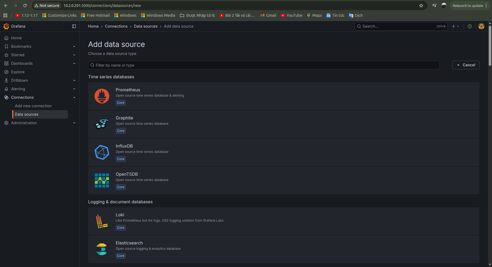
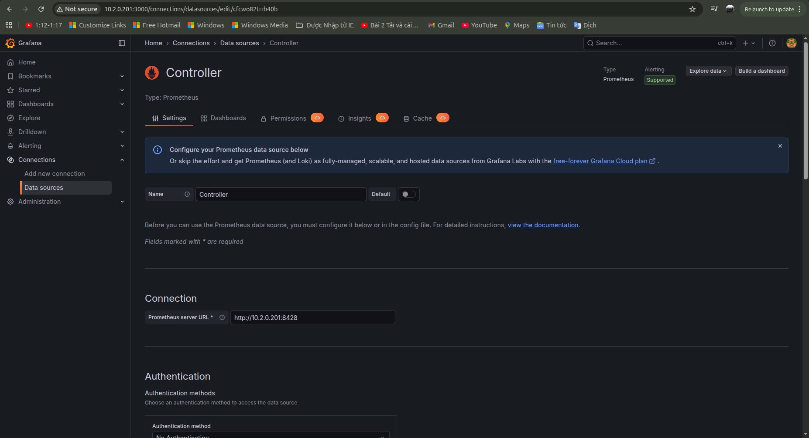
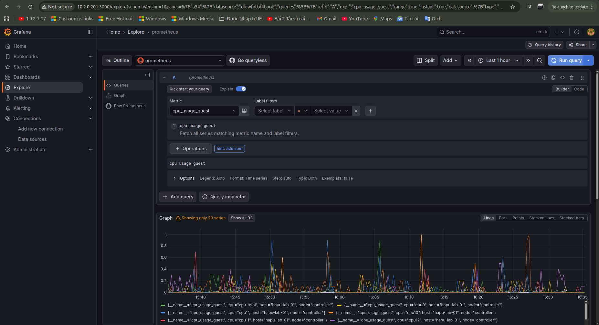

# 1. Chạy VictoriaMetrics
Run a single-node VictoriaMetrics instance:

```sh
docker run -d --name victoriametrics -p 8428:8428 victoriametrics/victoria-metrics:latest
```

Để lưu dữ liệu trên server, mount một volume đến container

```sh
docker run -d --name victoriametrics -p 8428:8428 \
  -v /path/to/vmdata:/victoria-metrics-data \
  victoriametrics/victoria-metrics:latest \
  -storageDataPath=/victoria-metrics-data
```

Cấu hình thêm:
- `-storageDataPath`: Đường dẫn đến thư mục nơi `time series data` được lưu. Mặc định: victoria-metrics-data

- `-retentionPeriod`: Chỉ định thời gian lưu giữ data

- `-httpListenAddr`: Địa chỉ TCP để lắng nghe HTTP request

# 2. Cài telegraf
Chạy lệnh cài cho server chạy ubuntu từ phiên bản 20.04 trở lên:
```sh
curl --silent --location -O https://repos.influxdata.com/influxdata-archive.key
gpg --show-keys --with-fingerprint --with-colons ./influxdata-archive.key 2>&1 \
| grep -q '^fpr:\+24C975CBA61A024EE1B631787C3D57159FC2F927:$' \
&& cat influxdata-archive.key \
| gpg --dearmor \
| sudo tee /etc/apt/keyrings/influxdata-archive.gpg > /dev/null \
&& echo 'deb [signed-by=/etc/apt/keyrings/influxdata-archive.gpg] https://repos.influxdata.com/debian stable main' \
| sudo tee /etc/apt/sources.list.d/influxdata.list
sudo apt-get update && sudo apt-get install telegraf
```

Tạo file /etc/telegraf/telegraf.conf
```sh
[agent]
  interval = "10s"
  flush_interval = "10s"

[global_tags]
  node = "controller"

[[outputs.http]]
  url = "http://10.2.0.201:8428/api/v1/write"
  data_format = "prometheusremotewrite"

[[inputs.cpu]]
  totalcpu = true
  percpu = true

[[inputs.mem]]

[[inputs.disk]]
  ignore_fs = ["tmpfs", "devtmpfs"]

[[inputs.net]]

[[inputs.system]]
```

# 3. Cài Grafana
Chạy một container cho Grafana:
```sh
docker run -d -p 3000:3000 --name=grafana grafana/grafana-enterprise
```

Dùng docker volumes để lưu dữ liệu của Grafana
```sh
# create a persistent volume for your data
docker volume create grafana-storage

# verify that the volume was created correctly
# you should see some JSON output
docker volume inspect grafana-storage
```

Chạy container Grafana:
```sh
# start grafana
docker run -d -p 3000:3000 --name=grafana \
  --volume grafana-storage:/var/lib/grafana \
  grafana/grafana-enterprise
```

# 4. Thêm datasource và Dashboard Grafana
Add data source: menu -> Connections -> Data sources -> Add a new data sources -> Prometheus


Nhập tên và đường dẫn kết nối đến Victoria Metrics -> save & test


Chạy query: menu -> Explore -> Chọn tên của datasource vừa tạo -> Chọn metric -> Run query để hiển thị
 


