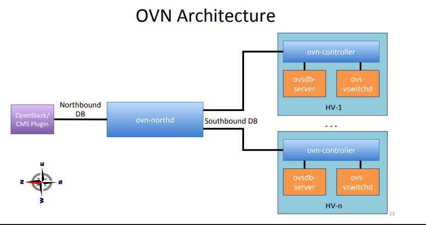
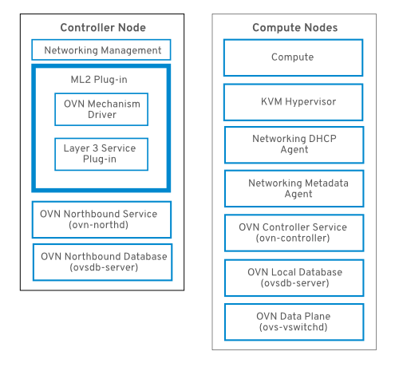

# Kiến trúc

Kiến thúc OVN thay thế OVS ML2 plugin bằng OVN Modular Layer 2 plugin để hỗ trợ networking API 

Kiến trúc OVN gồm các thành phần và dịch vụ sau:

- OVN ML2 plugin: Plugin này chuyển đổi cấu hình mạng dành riêng cho OpenStack thành cấu hình mạng logic OVN không phụ thuộc vào nền tảng. Plugin này thường chạy trên node Controller.

- OVN Northbound (NB) database (ovn-nb): Lưu trữ cấu hình mạng logic của OVN từ plugin OVN ML2. CSDL này thường chạy trên node controller và trên port 6641 với TCP

- OVN Northbound service (ovn-northd): Chuyển đổi cấu hình mạng logic từ OVN NB database thành luồng dẫn dữ liệu logic và điền vào CSDL OVN Southbound. Dịch vụ này thường chạy trên node controller

- OVN Southbound (SB) database (ovn-sb): Lưu trữ luồng dữ liệu logic đã được chuyển đổi. SDL này thường chạy trên node controller và trên port 6642 với TCP

- OVN controller (ovn-controller): Kết nối đến OVN SB database và hoạt động như controller của openvSwitch để điều khiển và giám sát lưu lượng. Chạy trên tất cả các node compute và node gateway nơi mà `OS::Tripleo::Services::OVNController` được định nghĩa

- OVN metadata agent (ovn-metadata-agent): Khởi tạo các instance `haproxy` để quản lý OVS interfaces, network namespace và các tiến trình HAProxy được dùng để chuyển tiếp trung gian các yêu cầu metadata API. Chạy trên tất cả các node compute và node gateway nơi mà `OS::TripleO::Services::OVNMetadataAgent` được định nghĩa

