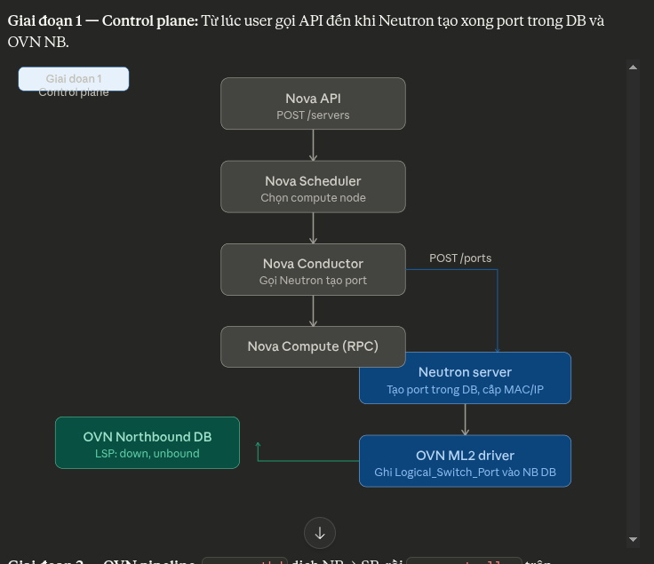
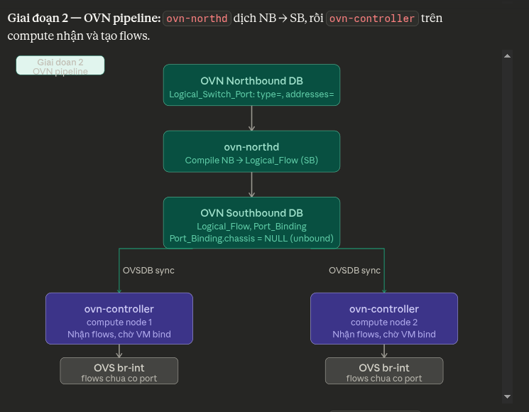
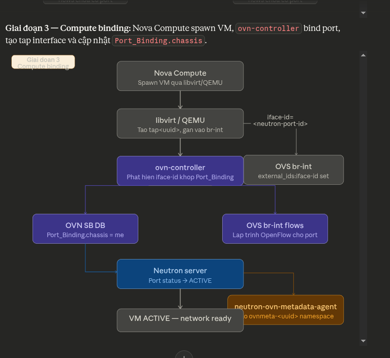

# Mariadb
MariaDB sử dụng Galera

Cấu hình /etc/mysql/conf.d/gelara.cnf

https://viblo.asia/p/huong-dan-cau-hinh-mariadb-galera-cluster-va-maxscale-018J2bylJYK

Thêm user haproxy để tránh bị lỗi lost connection

# rabbitmq cluster
https://docs.openstack.org/ha-guide/control-plane-stateful.html#rabbitmq-configure

Có cả 2 file tại /var/lib/rabbitmq/.erlang.cookie và /root/.erlang.cookie trên các node 

systemctl enable rabbitmq-server.service
systemctl start rabbitmq-server.service

rabbitmqctl stop_app
Stopping node rabbit@NODE...
...done.
rabbitmqctl join_cluster --ram rabbit@rabbit1
rabbitmqctl start_app

rabbitmqctl cluster_status

# Cấu hình HAproxy

# Cấu hình apache2

# Cấu hình glance 
sửa host và port bind (mặc định bind toàn bộ interface)

# Neutron + compute
ovs-vsctl set open . \
  external-ids:ovn-remote=tcp:10.2.2.211:6642,tcp:10.2.2.216:6642,tcp:10.2.2.218:6642

127.0.0.1:6640

# OVN
ovs-appctl -t /var/run/ovn/ovnnb_db.ctl cluster/status OVN_Northbound
ovs-appctl -t /var/run/ovn/ovnsb_db.ctl cluster/status OVN_Southbound

Nova tạo VM
  │
  ▼
ovn-controller (trên compute) nhận binding từ OVN Southbound DB
  │
  ▼
ovn-controller tạo port trên br-int (OVS)
  │
  ▼
neutron-ovn-metadata-agent watch OVN SB DB
(monitor bảng Port_Binding, Datapath_Binding)
  │
  ▼
Agent tự tạo:
  ├── network namespace: ovnmeta-<network-uuid>
  ├── veth pair: (ovnmeta-<id> ↔ tap trong namespace)
  ├── connect veth vào br-int
  └── start haproxy trong namespace (proxy metadata request)

ovn-sbctl show: xem các node compute đã chassis port nào chưa

https://discuss.linuxcontainers.org/t/ovn-high-availability-cluster-tutorial/11033/1

