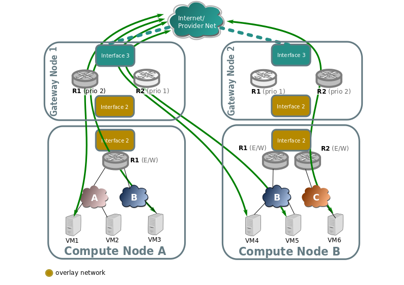
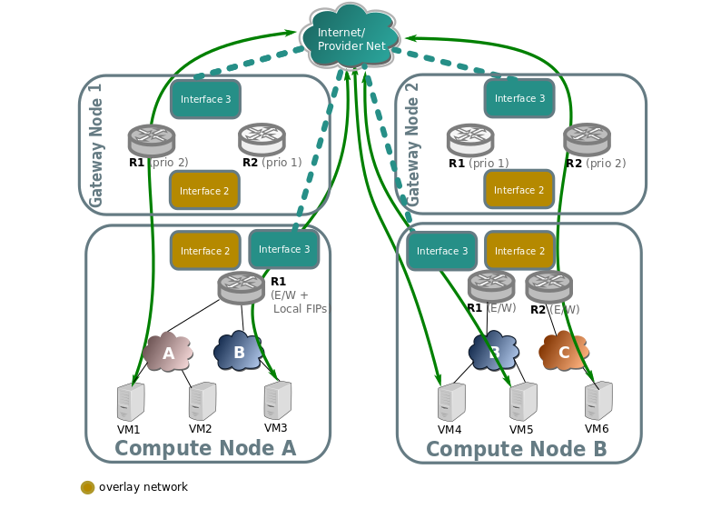

# 1.OVN Logical Switch Ports
Hiển thị các port được lưu tại nb db các network:

    ovn-nbctl show      #Show toàn bộ các network và router
    #Hoặc
    ovn-nbctl show neutron-<network-uuid>      #Show cho 1 network cụ thể

Port type:

- Empty type: Port thông thường dùng cho vm

- router: Port kết nối từ logical switch đến logical router

- localnet: Dùng khi kết nối đến một provider network

- localport: Thường dùng cho internal serivce như là metadata

Để show thông tin của toàn bộ port:

    ovn-nbctl list Logical_Switch_Port

# 2. OVN DHCP Options
Các thiết lập về subnet được auto dịch sang một bảng dhcp_options nội bộ của OVN

Câu lệnh kiểm tra:

    ovn-nbctl find DHCP_Options external_ids:subnet_id="<SUBNET_UUID>"

    # Ví dụ
    root@hapu-lab-01:~# ovn-nbctl find DHCP_Options external_ids:subnet_id=bec166af-8bc0-4b98-9bc6-1c525b049eb1
    _uuid               : 40149081-fd4a-46a8-8365-1f1c36620435
    cidr                : "10.2.2.0/24"
    external_ids        : {"neutron:revision_number"="0", subnet_id="bec166af-8bc0-4b98-9bc6-1c525b049eb1"}
    options             : {classless_static_route="{169.254.169.254/32,10.2.2.205, 0.0.0.0/0,10.2.2.1}", dns_server="{8.8.8.8}", lease_time="43200", mtu="1500", router="10.2.2.1", server_id="10.2.2.1", server_mac="fa:16:3e:41:0b:d1"}

Debug:

    ovn-sbctl find logical_flow external_ids:stage-name=ls_in_dhcp_options
    
# 3. Router
### 3.1. Node gateway
Có nhiệm vụ xử lý lưu lượng north-south (vm -> internet)

Tác dụng:
- SNAT/DNAT and floating IPs

- External network connectivity

- High-availability (HA) router traffic

- Providing uplink to physical networks via bridges such as br-ex

Cấu gần gần giống như node compute, có thêm option `enable-chassis-as-gw`:

    ovs-vsctl set open . external-ids:ovn-cms-options=enable-chassis-as-gw

### 3.2. Internal router port
Đại diện cho kết nối giữa router và tenant network. Không có gateway chassis được định nghĩa ở đây

    root@hapu-lab-01:~# ovn-nbctl list Logical_Router_Port lrp-63f261b5-52de-4275-b985-77cc97dd35d0
    _uuid               : 95f40c34-64bd-440e-9213-d1e19d8bec9c
    dhcp_relay          : []
    enabled             : []
    external_ids        : {"neutron:is_ext_gw"=False, "neutron:network_name"=neutron-e6df2575-d191-45c6-b5a0-831dc7849b35, "neutron:revision_number"="2", "neutron:router_name"="3b204499-ae9c-4f17-980a-26d6d1beadf7", "neutron:subnet_ids"="1deb6687-de14-472c-a6f6-848493ac32b1"}
    gateway_chassis     : []
    ha_chassis_group    : []
    ipv6_prefix         : []
    ipv6_ra_configs     : {}
    mac                 : "fa:16:3e:70:d5:f6"
    name                : lrp-63f261b5-52de-4275-b985-77cc97dd35d0
    networks            : ["192.168.10.1/24"]
    options             : {}
    peer                : []
    status              : {}

### 3.3. External router port and gateway chassis mapping

    root@hapu-lab-01:~# ovn-nbctl list Logical_Router_Port lrp-f49c64be-3143-44dc-b88e-505b910c548a
    _uuid               : bf27adc1-8a50-4e82-be0c-27f527a5d04c
    dhcp_relay          : []
    enabled             : []
    external_ids        : {"neutron:is_ext_gw"=True, "neutron:network_name"=neutron-663a3c94-92f2-4469-89b5-1db866a20667, "neutron:revision_number"="5", "neutron:router_name"="3b204499-ae9c-4f17-980a-26d6d1beadf7", "neutron:subnet_ids"="bec166af-8bc0-4b98-9bc6-1c525b049eb1"}
    gateway_chassis     : [29138153-d277-4de4-a3b5-cdb8b9ba58c0]
    ha_chassis_group    : []
    ipv6_prefix         : []
    ipv6_ra_configs     : {}
    mac                 : "fa:16:3e:12:e1:33"
    name                : lrp-f49c64be-3143-44dc-b88e-505b910c548a
    networks            : ["10.2.2.213/24"]
    options             : {gateway_mtu="1442", reside-on-redirect-chassis="true"}
    peer                : []
    status              : {hosting-chassis="86544e54-a6d7-4428-b12d-199a7de6c7eb"}

Đại diện cho kết nối giữa router và provider network

Phần gateway_chassis: có tồn tại một giá trị hoặc nhiều, có nhiệm vụ giúp vm kết nối ra ngoài internet

    ovn-nbctl list Logical_Router_Port <PORT_UUID>    # Hiển thị thông tin router port

    ovn-nbctl list Gateway_Chassis <GW_CHASSIS_UUID>    # Hiện thị thông tin của gateway chassis
    
    ovn-sbctl list Chassis <CHASSIS_UUID>    # Hiện thị thông tin cụ thể của chassis

Set priority cho gateway-chassis, priority càng cao thì node đó sẽ cho traffic đi qua, các node còn lại để dự phòng

    ovn-nbctl lrp-set-gateway-chassis <lrp-name> <chassis-name> <priority> 

# 4. Distributed FIPs
### 4.1. Non-Distributed Floating IP
Quá trình SNAT và DNAT xảy ra trên node gateway, mọi traffic từ VPC sẽ đi đến node gateway và được Nat để đi ra Internet

### 4.2. Distributed Floating IP
Quá trình SNAT và DNAT xảy ra ngay trên node compute

Trên node compute phải có interface uplink như các node gateway

Traffic đi thẳng từ compute ra ngoài internet

Không cần tunnel qua node gateway nữa, giúp giảm độ trễ

    ovn-nbctl lr-nat-list <router-name>   # Xem bảng NAT

Lưu ý:
- Phải có FIP gắn vào vm mới xảy ra NAT trên node compute

- Khi không có FIP thì traffic vẫn đi đến node gateway và SNAT với ip của router nối với external network

