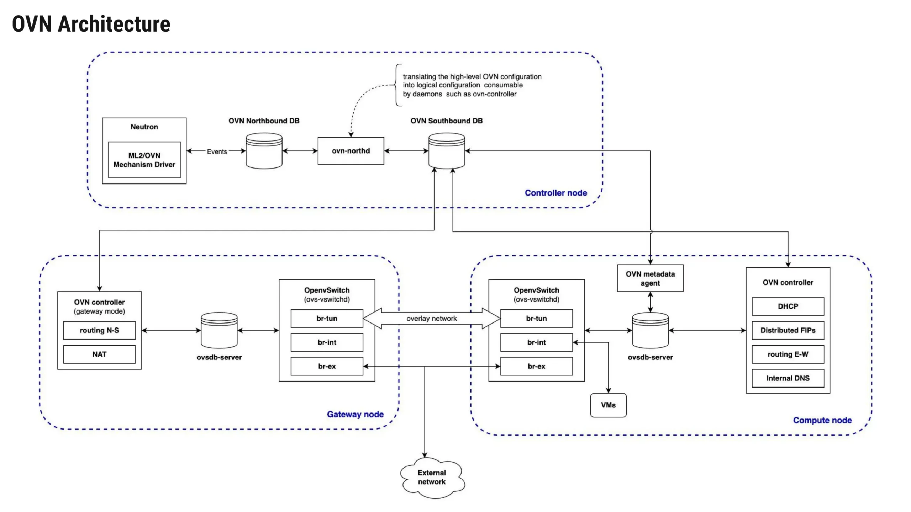
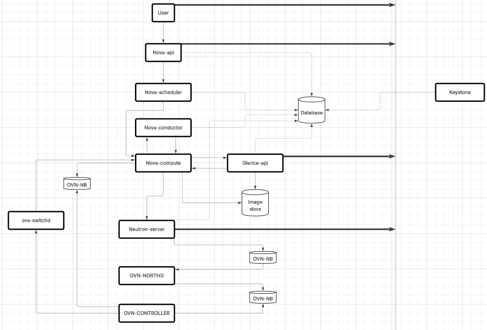

# Tạo port và bind port
Giai đoạn 1:
    
    user request -> nova api/neutron -> tạo logical port trong DB -> ML2/OVN plugin -> Ghi port vào NB DB -> northdb biên dịch ra Port_binding và flow -> Ghi vào SB DB (đánh dấu chưa bind)
    
Giải đoạn 2:

    Node compute -> gọi VIF driver, tạo tap/veth interface và add vào br-int của OVS (thêm thông tin cho port UUID) -> ovn-controller đọc OVS-DB thấy có trùng UUID với 1 Port_binding ở SB DB -> Claim port bằng cách chassis=Hostname -> OVN-CONTROLLER lập trình flow cho các brigde OVS (L2 forwarding, ARP proxy, DHCP responder, Geneve tunnel tới các chassis khác) 

# Cấp ip dhcp

    vm gửi dhcp discover -> tap -> br-int -> Lọc qua các rule -> ovn-controller (local) -> offer -> br-int -> lọc qua rule -> tap -> vm -> ack

# Quá trình tạo vm với OVN

