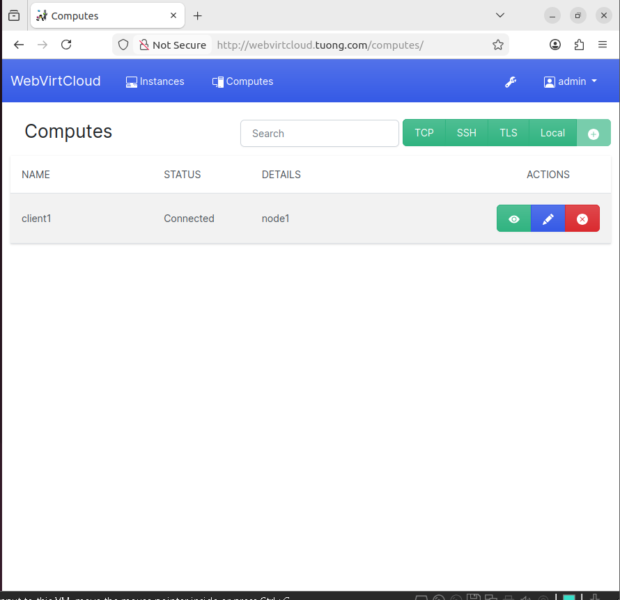

# 1. Tổng quan
Webvirtmgr là một trong những công cụ quản lý máy ảo KVM. Nó có chức năng gần giống với virt-manager khi có thể kết nối đến nhiều host KVM để có thể quản lý tập trung các VM trên các máy đó

Nhưng nó có một ưu điểm đặc biệt hơn so với virt-manager đó là với virt-manager đó là ta chỉ có thể làm việc tại máy cài virt-manager. Còn với Webvirtmgr ta có thể làm việc với các VM ở bất kỳ đâu có internet

Hiện nay có 3 cách để triển khai webvirt:
- Cài đặt KVM và webvirt trên một máy

- Cài đặt KVM và webvirt trên hai máy khác nhau

- Cài đặt webvirt ngay trên máy ảo của KVM

# 2. Tạo VM bằng webvirt
### 2.1. Thêm các host chạy KVM vào webvirt
Tạo và copy SSH key trên máy chạy webvirt
```sh
    sudo mkdir -p /var/www/.ssh 
    sudo chown -R www-data:www-data /var/www/.ssh
    sudo -u www-data ssh-keygen
```

Copy key đến máy chạy KVM
```sh
    ssh-copy-id -i /var/www/.ssh/id_rsa.pub [username@hostIP]
```

Thêm máy chạy KVM vào webvirt
- Vào giao diện trang web của webvirt -> Computes -> SSH -> Sau đó nhập thông tin của cho máy chạy KVM -> Save


- Quản lý các host chạy KVM


### 2.2. Tạo máy ảo 