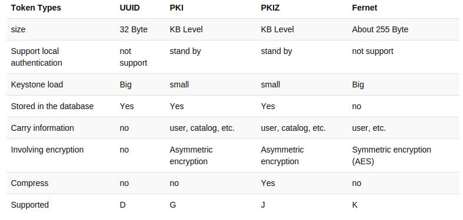

# 1. Token là gì
- Để user truy cập bất cứ OpenStack API nào thì user cần chúng minh họ là ai và họ được phép gọi tới API. Để làm được điều này, họ cần có token và "dán" chúng vào "API call". Keystone chính là service chịu trách nhiệm tạo ra tokens

- Sau khi được xác thực thành công bởi keystone thì user sẽ nhận được token. Token cũng chứa các thông tin ủy quyền của user trên cloud

- Token bao gồm phần ID và payload. ID được dùng để đảm bảo rằng nó là duy nhất trên mỗi cloud và payload chứa thông tin của user

# 2. Các loại token trong keystone
### 2.1 UUID tokens
- UUID là token format đầu tiên của keystone, nó đơn giản chỉ là một chuỗi UUID gồm 32 kí tự được generate random. Nó được xác thực bởi identity service. Phương thức hexdigest() được sử dụng để tạo ra chuỗi kí tự hexa. Điều này khiến token URL trở nên an toàn và dễ dàng trong việc vận chuyển đến các môi trường khác

- UUID token buộc phải được lưu lại trong một backend (thường là database). Nó cũng có thể được loại bỏ bằng các sử dụng DELETE request với token id. Tuy nhiên nó sẽ không thực sự bị loại bỏ khỏi backend mà chỉ được đánh dấu là đã được loại bỏ. Vì nó chỉ có 32 bytes nên kích thước của nó trong HTTP header cũng sẽ là 32 bytes

- Loại token này rất nhỏ và dễ sử dụng quy nhiên nếu sử dụng nó, Keystone sẽ là "cổ chai" của hệ thống bởi mọi cuộc giao tiếp đều cần tới keystone để xác thực token

- UUID thường dc lưu định danh cho các dịch vụ trong openstack.

### 2.2. PKI


- PKI Token là một cơ chế xác thực thay thế cho các token truyền thống (như UUID Token) trong OpenStack Keystone, sử dụng chữ ký điện tử và hạ tầng khóa công khai (PKI) để đảm bảo tính toàn vẹn và tính xác thực của token

### 2.3. PKIZ (PKI + Zip)


- PKIZ giống với PKI nhưng token sẽ được nén lại để giảm kích thước

### 2.3. Fernet


- Đây là loại token mới nhất, nó được tạo ra để khắc phục những hạn chế của các loại token trước đó:

    + Thứ nhất, nó khá nhỏ với khoảng 255 kí tự, lớn hơn UUID nhưng nhỏ hơn rất nhiều so với PKI. Token này cũng chứa vừa đủ thông tin để cho phép nó không cần phải được lưu trên database

    + Thứ 2 nó chứa một lượng nhỏ dữ liệu ví dụ như thông tin để nhận diện người dùng, project, thời gian hết hiệu lực,...Nó được sign bởi symmetric key để ngăn ngừa việc giả mạo. Cơ chế hoạt động của loại token này giống với UUID vì thế nó cũng phải được validate bởi Keystone

- Một trong những vấn đề của loại token này đó là nó dùng symmetric key để mã hóa token và các keys này buộc phải được phân phối lên tất cả các region của OpenStack

#### 2.3.1. Các loại fernet  key
- Loại 1: Primary key
    + Dùng để mã hóa và giải mã

    + File name có số index cao nhất

- Loại 2: Secondary key
    + Chỉ được dùng để giải mã

    + file name có số index nằm giữa private key và staged key

- Loại 3: Staged key
    + Giải mã và chuẩn bị để chuyển thành primary key

    + file name nhỏ nhất (0)

#### 2.3.2. Fernet rotation


- Fernet keys cũng cần được rotated

- File fernet key
```sh
    /etc/keystone/fernet-keys
```

- Trong cùng một thời điểm:
    + Primary key có nhiệm vụ giải mã và mã hóa token được tạo ra
    
    + Secondary key (nếu có) có nhiệm vụ giải mã các token được mã hóa từ primary key trước đó (Lúc mà secondary key vẫn còn là primary key)
    
    + Staged key có nhiệm vụ chuẩn bị để trở thành primary key 

- Lưu ý: số lượng secondary key có trong repo phụ thuộc vào thời điểm hiện tại, thời gian token tồn tại và thời gian rotated

- Mục đích: Mục đích chính của việc rotated khóa là tăng cường bảo mật bằng cách giới hạn lượng dữ liệu (token) được mã hóa bằng cùng một khóa
    + Nếu một khóa Fernet bị lộ, chỉ những token được tạo ra trong chu kỳ sử dụng của khóa đó mới có thể bị giải mã. Việc xoay khóa thường xuyên sẽ giới hạn thiệt hại này

    + Nó cho phép các máy chủ dịch vụ (như Nova, Glance) tiếp tục xử lý các token cũ (được mã hóa bằng khóa cũ) trong khi đồng thời chấp nhận và tạo ra các token mới (bằng khóa mới)

- Khi sử dụng fernet tokens yêu cầu chú ý về thời hạn của token và vòng đời của khóa

- Có thể cấu hình số key tối đa tồn tại, nếu vượt quá số key này key cũ sẽ bị xóa. Các thông số này được cấu hình trong file `keystone.conf`

- Key Rotation Strategy (Chiến lược xoay vòng key) gồm 3 phần sau:
    + The rotation frequency

    + The token lifespan (set with [token] expiration)

    + The number of active keys: (set with [fernet_tokens] max_active_keys)

- Giá trị `max_active_keys` cần tối thiểu 3 key, thường thì sẽ được xác định bởi `token lifespan` và `rotation frequency`. Nó thường lớn hơn `token lifespan` / `rotation frequency`, và thường sẽ để lớn hơn 2

# 3. So sánh các loại token



