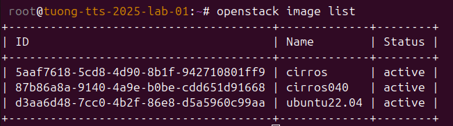
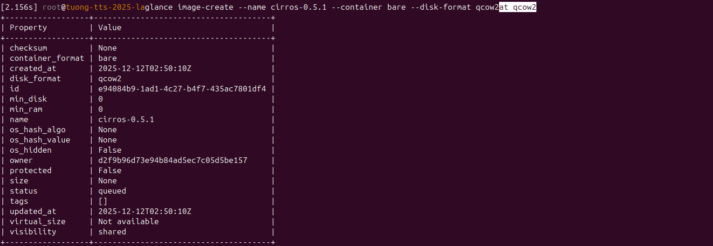

# Một số câu lệnh thao tác sử dụng Glance

### 1. Tạo image
Để upload image lên thư mục của glance từ file image có sẵn, sử dụng lệnh một trong 2 câu lệnh sau

```sh
glance image-create --file cirros-0.4.0-x86_64-disk.img --disk-format qcow2 --container-format bare --public --name cirros040
# Hoặc
openstack image create --disk-format qcow2 --container-format bare \
--public --file cirros-0.4.0-x86_64-disk.img cirros040
```

Trong đó :

- disk-format: Là kiểu lưu trữ của disk trong glance.

- container-format: Là định dạng file và loại metadata được lưu trong glance.

- file: Đường dẫn đên file image muôn upload lên glance.

- public: Trạng thái của image đc chia sẻ giữa các project.

- name: Tên images đươc lưu trong glance.


### 2. Hiển thị danh sách image
Sử dụng câu lệnh sau để lấy danh sách các image được phép truy cập

```sh
glance image-list
# Hoặc
openstack image list
```



### 3. Hiển thị thông tin của image
Để hiển thị thông tin chi tiết 1 image, sử dụng câu lệnh

```sh
glance image-show [image_id]
```


### 4. Upload image

Như ta thấy nó không có giá trị os_hash_value là nó chưa có dữ liệu gì bên trong

Trong trường hợp ta tạo ra một image mới và rỗng, ta cần upload dữ liệu cho nó, sử dụng câu lệnh

```sh
glance image-upload --file cirros-0.4.0-x86_64-disk.img e94084b9-1ad1-4c27-b4f7-435ac7801df4
```

### 5. Xóa image
Để xóa image, ta sử dụng câu lệnh

```sh
glance image-delete e94084b9-1ad1-4c27-b4f7-435ac7801df4
```

### 6. Thay đổi trạng thái máy ảo
Như ta đã biết một image upload thành công sẽ ở trạng thái active, người dùng có thể đưa nó về trạng thái deactivate cũng như thay đổi qua lại giữa hai trạng thái bằng câu lệnh

```sh
# Deactivate
glance image-deactivate [image_id]

# Reactivate
glance image-reactivate [image_id]
```


