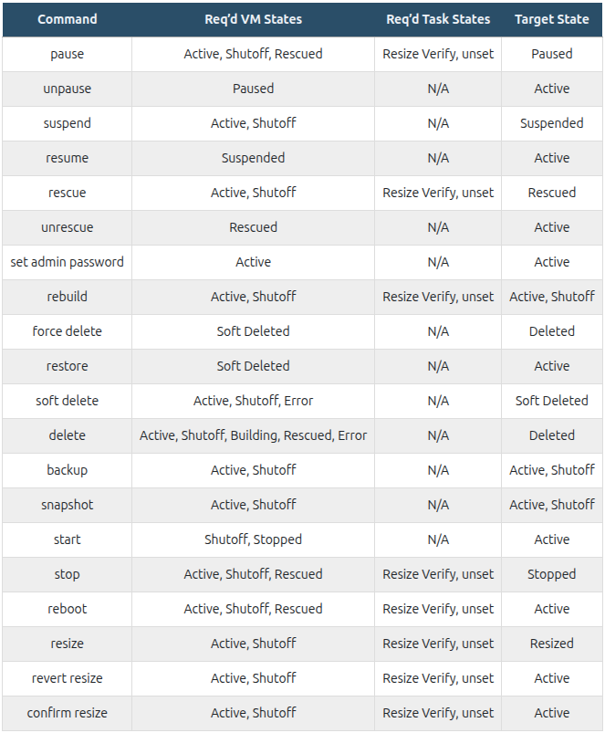

# 1. Quá trình tạo một máy ảo

1. Người dùng cuối(có thể là Dashboard, CLI hay qua API) gửi thông tin đăng nhập tới Keystone để xác thực. Sau khi Keystone xác thực được thông tin đăng nhập của người dùng, trả về cho người dùng hay trình duyệt một auth-token. Người dùng sau đó sẽ sử dụng token này cho những lần request tiếp theo đến các dịch vụ trong Openstack

2. User sử dụng auth-token để gửi yêu cầu tạo máy ảo đến Nova-API

3. Nova-API lấy auth-token từ yêu cầu của người dùng, gửi đến Keystone để xác thực xem auth-token đã hết hạn chưa và user có quyền là gì

4. Keystone trả về kết quả xác thực và ủy quyền của auth-token về cho Nova-API

5. Nếu Token được xác thực và có quyền tạo máy ảo, Nova sẽ bắt đầu tạo máy ảo. Nova API sẽ gửi yêu cầu ghi thông tin của máy ảo đến nova-conductor

6. Nova conductor gọi đến database để ghi thông tin máy ảo đang tạo

7. Sau đó Nova-API sẽ gửi yêu cầu đến Nova-scheduler để lên lịch tạo máy ảo

8. Nova-Scheduler sẽ tìm compute host trong DB và chọn compute host theo filter và weight. Sau khi chọn được compute host, scheduler gửi yêu cầu theo RPC message đến compute host được chọn

9. Nova lấy thông tin máy ảo cần tạo từ database bằng cách gửi yêu cầu đến nova-conductor

10. Sau khi lấy được thông tin máy ảo, Nova biết máy ảo sử dụng image nào, từ đó thực hiện yêu cầu đến glane, glance xác thực token, trả về nova-compute url của image muốn sử dụng

11. Nova compute tải image từ Glance về compute host

12. Nova compute gửi yêu cầu tạo các thông tin cơ bản về network cho máy ảo đến Neutron. Neutron xác thực token, và gửi lại các thông tin vể network cho máy ảo về Nova compute

13. Nova compute gửi yêu cầu tới Cinder để tạo và thiết lập thông tin để gán volume vào máy ảo. Sau đó nó gửi thông tin về cho Nova compute về volume

14. Với các thông tin từ các dịch vụ khác nhau, Nova compute thực hiện yêu cầu đến Hypervisor để tạo máy ảo

# 2. Luồng trạng thái của một máy ảo trên Openstack
Sơ đồ dưới đây môt tả luồng các trạng thái mà máy ảo có thể có.

### Một số câu lệnh làm việc với trạng thái của máy ảo

### Trạng thái VM và câu lệnh khả dụng

### Create Instance States
Sơ đồ dưới đây thể hiện trình tự các VM states, task states, và power states khi một VM instance mới được khởi tạo trong Nova

