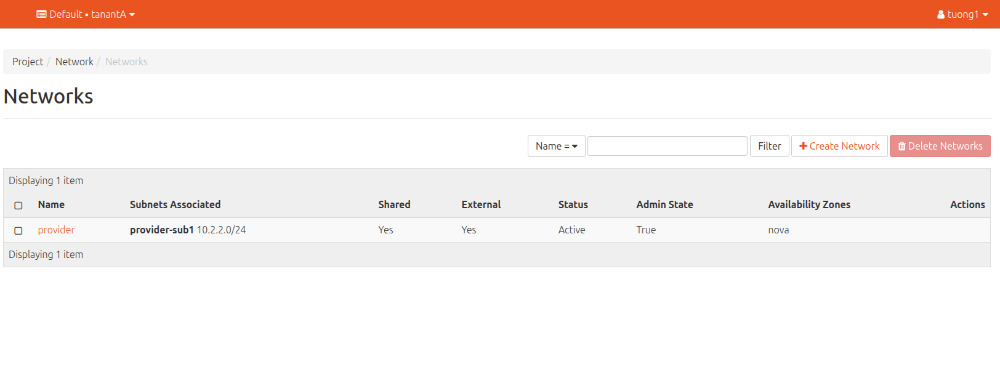

# 1. RBAC là gì ?
- RBAC viết tắt của Role-based access control.

- Trong các phiên bản openstack cũ, Neutron cung cấp cho người dùng tính năng chia sẻ tài nguyên mạng giữa các tenant(project). Khi 1 tài nguyên mạng được chỉ định là shared, thì nó sẽ được chia sẻ cho tất cả các tenant trong môi trường openstack. Điều này có nghĩa, 1 tài nguyên chỉ có thể shared cho tất cả hoặc không shared cho bất kì tenant nào (all-or-nothing). Điều này gây ra nhiều bất tiện và đôi khi, dẫn tới cả các rủi ro về bảo mật và quyền riêng tư.

- Để giải quyết vấn đề này, từ phiên bản liberty, openstack cung cấp tính năng role-based access control cho network (RBAC), cho phép người dùng có thể chỉ định việc chia sẻ tài nguyên mạng với 1 nhóm tenant xác định.

# 2. Các câu lệnh
Để quản lí RBAC
```sh
openstack network rbac [create/list/delete/show]
```

Từ những api này ta có thể tạo nên role-based access controll table với các entries quy định việc chia sẻ tài nguyên mạng giữa các tenant thông qua object type, target project/project-domain, action và RBAC_OBJECT
```sh
usage: openstack network rbac create [-h] [-f {json,shell,table,value,yaml}] [-c COLUMN] [--noindent] [--prefix PREFIX] [--max-width <integer>] [--fit-width] [--print-empty]
                                     [--extra-property type=<property_type>,name=<property_name>,value=<property_value>] --type <type> --action <action>
                                     (--target-project <target-project> | --target-all-projects) [--target-project-domain <target-project-domain>] [--project <project>]
                                     [--project-domain <project-domain>]
                                     <rbac-object>
```

- object type: Kiểu tài nguyên cần chia sẻ ('address_group', 'address_scope', 'security_group', 'subnetpool', 'qos_policy', 'network')

- target project/project-domain: là UUID của tenant(project/project-domain) được share phần tài nguyên này

- action: access_as_external hoặc access_as_shared

- rbac-object: là UUID của phần tài nguyên muốn chia sẻ

# 3. Ví dụ: Tạo một RBAC policy
- Trước tiên ta tạo 3 project A B C với các user tương ứng là tuong1, userB và userC:
```sh
openstack project create tanantA
openstack project create tanantB
openstack project create tanantC
```

- Tạo các user và add các role vào các user đó
```sh
openstack user create tuong1 --password tuong123
openstack role add --project tanantA --user tuong1 role-rbac

openstack user create userB --password userB
openstack role add --project tanantB --user userB role-rbac

openstack user create userC --password userC
openstack role add --project tanantC --user userC role-rbac
```

- Tạo một network
```sh
openstack network create rbac-network
```

- Ở đây ta để ý trường shared network được set là false, tức là chỉ được sử dụng bởi user admin. Nếu trường này được set là true, vùng mạng này sẽ được chia sẻ cho tất cả các tenant, đây là điều mà ta không mong muốn.

- Tạo 1 subnet trong vùng mạng này:
```sh
openstack subnet create --subnet-range 172.17.0.0/16 --network rbac-network rbac-network-sub1
```

### Tạo RBAC policy
- Ta sẽ gán quyền truy cập vào network rbac-network cho các user trong tenantA thông qua rbac policy. Nhưng trước tiên, ta kiểm tra sự tồn tại của rbac-network:

- Đăng nhập với user admin, ta thấy sự xuất hiện của rbac-network:


- Đăng nhập với user tuong1, không thấy sự xuất hiện của rbac-network:



- Để gán quyền truy cập rbac-network cho tenantA, ta tạo 1 rbac policy có dạng:

```sh
root@hapu-lab-01:~# openstack network rbac create --target-project 7c1c9e28c63a418b9dfc5d7144217519 --type network --action access_as_shared 05a9bc9a-ceb8-4010-bdf0-e5ac71b38ad8
```
- --target-project: id của tenantA
- rbac-object: id của network rbac-network

- Kiểm tra thấy tenantA đã xuất hiện network rbac-network


