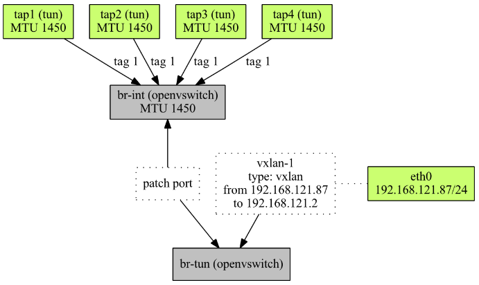

# OpenvSwitch firewall
```sh
[securitygroup]
firewall_driver = openvswitch
```
Để bảo về các vm khỏi những lưởng truy cập không mong muốn thì openstack sử dụng và triển khai tường lửa để kiểm soát truy cập các lưu lượng đó còn được gọi là Stateful firewall

Openstack theo dõi các kết nối riêng lẻ và các gói trong các kết nối được gọi là connection contrack hoặc conntrack. Các kết nối này là các kết nối 2 chiều và cần được thiết lập.

Openvswitch là môt switch ảo sử dụng nó có thể kết nối với các máy ảo khác nhau. Nhưng openvswitch đang hoạt động ở dạng luồng chỉ có 1 chiều và không có trạng thái nên thế ta cần kết hợp cả stateful firewall.

Trong nhân linux có chứa một module có khả năng theo dõi và sử dụng để triển khai 1 tường lừa stateful firewall, tuy nhiên module này chỉ có sẵn ở lớp giao thực IP tầng 3 trong OSI nó gọi là iptables. Tuy nhiên có 1 vấn đề là openvswitch không hoạt động ở giao thức IP( Layer 3) mà nó hoạt động ở laye 2 chình vì thế nó cần có 1 cầu nối để kết nối 2 layer này

Sử dụng linuxbridge có chứa cơ chế lọc riêng là ebtables mặc dù không thể sử dụng tính năng conntrack nhưng ta có thể cấu hình các chain cho nó như trong iptables. Bằng kỹ thuật này ta có thể sử dụng conntrack theo dõi chuyển gói giữa layer2 và layer3.

Trung tâm mỗi nút của openstack đưọc gọi là "integration bridge" hay br-int. Trong triển khai thì br-int là một openvswitch nó chịu trách nhiệm định hướng các gói giữa các máy ảo, tạo tunnel giữa các nút và một số tac vụ khác. Do đó mọi máy ảo để phải kết nói đến br-int.

stateful firewall cần được đặt giữa máy ảo và br-int ở đây ta sử dụng iptable trên linux bridge. Trên linux brige gọi các rule iptables và áp dụng các rules đó vào các ingress và egress.

Mô hình tổng quan sau khi đặt linuxbridge như sau.


- Máy ảo đầu tiên được kết nối với máy chủ thông qua giao diện tap1. Một gói tin ra khỏi máy ảo sau đó sẽ được chuyển hướng tới Linux bridge qbr1.

- Trên cầu nối đó, ebtables gọi vào iptables nơi gói đến được khớp theo các quy tắc đã định cấu hình.

- Nếu gói được chấp thuận, nó sẽ đi qua bridge và được gửi đến giao diện thứ hai được kết nối với bridge. Đó là qvb1 là một mặt của cặp veth.

- Veth pair là một cặp giao diện được kết nối nội bộ với nhau. Bất cứ thứ gì được gửi đến một trong các giao diện sẽ được nhận bởi một giao diện khác và ngược lại. Tại sao cần có cặp veth ở đây? Bởi vì chúng tôi cần một cái gì đó có thể kết nối giữa cây cầu Linux và cây cầu tích hợp Open vSwitch.

Bây giờ gói tin đã đạt đến br-int và được chuyển hướng đến máy ảo thứ hai. Nó đi ra khỏi br-int đến qvo2, sau đó qua qvb2 nó đến cầu qbr2. Gói tin đi qua ebtables và iptables và cuối cùng đến tap2 là máy ảo mục tiêu.

Điều này rõ ràng là rất phức tạp. Tất cả những cầu nối và giao diện đó làm tăng thêm chi phí xử lý CPU và thêm độ trễ. Hiệu suất bị ảnh hưởng.

Chính ví thể nên openvswitch đưa conntrack vào openswitch việc này loại bỏ sử dụng iptables trên linux bridge.

Dưới đây là sơ đồ sau khi đã bỏ đi linux bridge.



Một gói tin đi ra từ máy ảo đầu tiên (tap1) được chuyển hướng đến br-int. Nó được kiểm tra bằng cách sử dụng các quy tắc đã định cấu hình và bỏ hoặc xuất trực tiếp đến máy ảo thứ hai (tap2).


