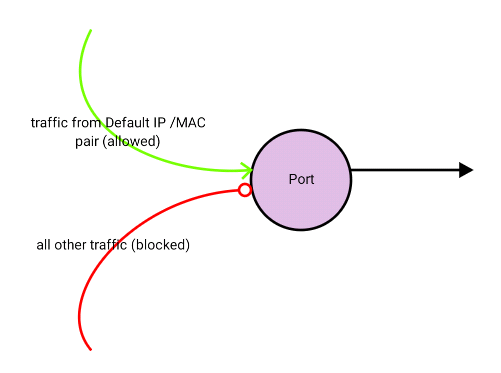

# 1. Security Group trong Openstack
## 1.1 Overview

- Security group là bộ các quy tắc để filter các IP, nó được áp dụng cho tất cả các instance để định nghĩa mạng truy cập và các máy ảo. Group rules được xác định cho các projects cụ thể, các user thuộc vào project nào thì có thể chỉnh sửa, thêm, xóa các rule của group tương ứng.

- Tất cả các project đều có một security-groups mặc định là default được áp dụng cho bất kỳ một instance nào không được định nghĩa một security group nào khác. Nếu không thay đổi gì thì mặc định security group sẽ chặn tất cả các incoming traffic với instance của bạn.

- Bạn có thể sử dụng option `allow_same_net_traffic` trong `file /etc/nova/nova.conf` để kiểm soát toàn bộ nếu các rules áp dụng cho host được chia sẻ mạng. Có hai giá trị có thể:

    + True (default)
        * Hosts cũng nằm trên một subnet không được lọc và được cho phép đi qua đối với tất cả các loại traffic giữa chúng. Trên Flat network, tất cả các instances của tất cả các project đề không được lọc khi giao tiếp với nhau. Với VLAN, cho phép truy cập giữa các instance cùng project. Bạn cũng có thể mô phỏng option này bằng cách cấu hình default security group cho phép tất cả các traffic từ subnet.

    + False
        * Security groups sẽ bắt buộc được áp dụng cho tất cả các kết nối, kể cả các kết nối cùng mạng.

- Ngoài ra, số lượng tối đa các rules trong một security group được điểu khiển bởi `security_group_rules` và số lượng các `security groups` cho một project được điểu khiển bởi `security_groups`

## 1.2 List and view current security groups
Có thể sử dụng command-line để lấy danh sách các security groups cho một project cụ thể bằng cách sử dụng openstack hoặc nova command:

1. Đảm bảo các giá trị xác thực về user và project có security groups muốn xem

```sh
export OS_USERNAME=myuser
export OS_TENANT_NAME=thanhbc
```

2. Sử dụng openstack command để xem danh sách các security group hiện có trong project:

```sh
 openstack security group list
```

3. Xem chi tiết một security group:

```sh
openstack security group rule list GROUPNAME
```

## 1.3 Create a security group
- Khi thêm một security group mới, nên pick thêm một mô tả ngắn gọn.

- Add thêm một security group mới:

```sh
openstack security group create GroupName --description Description
```

- Add một rule mới vào group:

```sh
openstack security group rule create SEC_GROUP_NAME --protocol PROTOCOL --dst-port FROM_PORT:TO_PORT --remote-ip CIDR
```

- Xem các rule có trong một security group:

```sh
openstack security group rule list <ID-sec-group>
```

- Để xem tất cả các rule trong các group ở tất cả các project:

```sh
neutron security-group-rule-list
```

## 1.4. Delete a security group
- Để xóa một new security group, thực hiện lệnh sau:

```sh
openstack security group delete GROUPNAME
```

## 1.5. Create security group rules for a cluster of instances
- Source Groups là một loại đặc biệt, linh động để xác định CIDR của các sources được cho phép. User cụ thể cho một Source Group (Security Group name) và tất cả các instance của user khác sử dụng một Source Group được lữa chọn linh động. Điều này làm giảm nhu cầu về các quy tắc riêng cho phép cho mỗi một user mới của cluster.

- Tạo source group:

```sh
openstack security group rule create secGroupName \
   --remote-group source-group --protocol ip-protocol \
    --dst-port from-port:to-port
```

# 2. Security port trong openstack.
## 2.1. Sercurity port là gì
- Port Security là cơ chế kiểm soát truy cập mạng ở cấp độ cổng mạng ảo (virtual port), chủ yếu dùng để bảo vệ các máy ảo (VM) khỏi các cuộc tấn công giả mạo (spoofing) bằng cách áp dụng các quy tắc chống giả mạo (anti-spoofing) để đảm bảo VM chỉ gửi/nhận traffic với địa chỉ MAC/IP được gán cho cổng của nó

- Nó bao gồm việc sử dụng Security Groups để chặn/cho phép traffic và các quy tắc chống giả mạo tích hợp trong Neutron, ngăn chặn VM sử dụng sai MAC hoặc IP, nhưng có thể cần tùy chỉnh cho các trường hợp đặc biệt như NFV

- Các thành phần chính của Port Security:
    + Security Groups (Nhóm Bảo mật): Tường lửa ảo cho cổng, kiểm soát traffic vào (ingress) và ra (egress) cho các VM. Mặc định, mọi traffic đều bị chặn trừ khi được cho phép bởi một Security Group.

    + Anti-Spoofing Rules: Các quy tắc tích hợp trong Neutron, ngăn VM sử dụng địa chỉ MAC hoặc IP không thuộc về nó. Điều này ngăn chặn các cuộc tấn công như ARP spoofing. 

## 2.2. Bổ sung địa chỉ ip qua port
Trong một số trường hợp nhất định, chúng tôi cần cho phép lưu lượng truy cập từ nhiều cặp địa chỉ IP / MAC đi qua một cổng hoặc cho nhiều cổng chia sẻ địa chỉ MAC hoặc địa chỉ IP. Một yêu cầu như vậy sẽ dành cho các trường hợp phân cụm. Để làm được điều này, chúng ta cần thêm các cặp địa chỉ IP / MAC này trên cổng.

- Bước 1: Xem danh sách các port
    ```sh
    root@tuong-tts-2025-lab-01:~# openstack port list
    ```
    ```sh
    +--------------------------------------+------+-------------------+------------------------------------------------------------------------------+--------+
    | ID                                   | Name | MAC Address       | Fixed IP Addresses                                                           | Status |
    +--------------------------------------+------+-------------------+------------------------------------------------------------------------------+--------+
    | 11c83b46-92bc-4d9f-a3f1-c2ec183508eb |      | fa:16:3e:4b:9f:4d | ip_address='10.20.1.226', subnet_id='440fd6f7-0f3e-4cb9-9d43-03c698a6ce78'   | ACTIVE |
    | 184c5656-24f5-4ab3-959d-043a3b778afe |      | fa:16:3e:46:3c:83 | ip_address='10.20.1.2', subnet_id='440fd6f7-0f3e-4cb9-9d43-03c698a6ce78'     | ACTIVE |
    |                                      |      |                   | ip_address='172.16.69.100', subnet_id='9624ce32-f483-47c6-8676-5cd56e0aad55' |        |
    | 5b3ca0ca-56af-4033-822c-3d6e4ac5223a |      | fa:16:3e:69:25:af | ip_address='10.20.1.156', subnet_id='440fd6f7-0f3e-4cb9-9d43-03c698a6ce78'   | DOWN   |
    | 6f1c55d6-d234-436e-be70-a748dc84ee5a |      | fa:16:3e:92:e0:18 | ip_address='172.16.69.149', subnet_id='9624ce32-f483-47c6-8676-5cd56e0aad55' | N/A    |
    +--------------------------------------+------+-------------------+------------------------------------------------------------------------------+--------+
    ```


    + Ví dụ này ta quan tâm đến port có `ID=11c83b46-92bc-4d9f-a3f1-c2ec183508eb` và địa chỉ `IP=10.20.1.226`

- Bước 2: Sử dụng lệnh sau để liệt kê chi tiết cổng
    ```sh
    root@tuong-tts-2025-lab-01:~# openstack port show 11c83b46-92bc-4d9f-a3f1-c2ec183508eb
    ```

    ```sh
    +-------------------------+--------------------------------------------------------------------------------------------------------------------------------------------+
    | Field                   | Value                                                                                                                                      |
    +-------------------------+--------------------------------------------------------------------------------------------------------------------------------------------+
    | admin_state_up          | UP                                                                                                                                         |
    | allowed_address_pairs   |                                                                                                                                            |
    | binding_host_id         | tuong-tts-2025-lab-01                                                                                                                      |
    | binding_profile         |                                                                                                                                            |
    | binding_vif_details     | bound_drivers.0='openvswitch', bridge_name='br-int', connectivity='l2', datapath_type='system', ovs_hybrid_plug='True', port_filter='True' |
    | binding_vif_type        | ovs                                                                                                                                        |
    | binding_vnic_type       | normal                                                                                                                                     |
    | created_at              | 2025-12-12T01:36:10Z                                                                                                                       |
    | data_plane_status       | None                                                                                                                                       |
    | description             |                                                                                                                                            |
    | device_id               | ea71650d-d398-455d-bfc7-fdc2f1bd0ef3                                                                                                       |
    | device_owner            | compute:nova                                                                                                                               |
    | device_profile          | None                                                                                                                                       |
    | dns_assignment          | None                                                                                                                                       |
    | dns_domain              | None                                                                                                                                       |
    | dns_name                | None                                                                                                                                       |
    | extra_dhcp_opts         |                                                                                                                                            |
    | fixed_ips               | ip_address='10.20.1.226', subnet_id='440fd6f7-0f3e-4cb9-9d43-03c698a6ce78'                                                                 |
    | hardware_offload_type   | None                                                                                                                                       |
    | hints                   |                                                                                                                                            |
    | id                      | 11c83b46-92bc-4d9f-a3f1-c2ec183508eb                                                                                                       |
    | ip_allocation           | None                                                                                                                                       |
    | mac_address             | fa:16:3e:4b:9f:4d                                                                                                                          |
    | name                    |                                                                                                                                            |
    | network_id              | 044b2b13-5c3c-422f-b7c8-4d32d861ad21                                                                                                       |
    | numa_affinity_policy    | None                                                                                                                                       |
    | port_security_enabled   | True                                                                                                                                       |
    | project_id              | d2f9b96d73e94b84ad5ec7c05d5be157                                                                                                           |
    | propagate_uplink_status | None                                                                                                                                       |
    | resource_request        | None                                                                                                                                       |
    | revision_number         | 8                                                                                                                                          |
    | qos_network_policy_id   | None                                                                                                                                       |
    | qos_policy_id           | None                                                                                                                                       |
    | security_group_ids      | a45b8a51-5600-422e-873f-6f09a6dd6c3f                                                                                                       |
    | status                  | ACTIVE                                                                                                                                     |
    | tags                    |                                                                                                                                            |
    | trunk_details           | None                                                                                                                                       |
    | trusted                 | None                                                                                                                                       |
    | updated_at              | 2025-12-16T02:51:17Z                                                                                                                       |
    +-------------------------+--------------------------------------------------------------------------------------------------------------------------------------------+
    ```

    + Dòng `allowed_address_pairs` hiện tại chưa được gán một giá trị nào, tức là chỉ được cho phép lưu lượng truy cập cho cặp MAC/IP mặc định của port (Các truy cập được lọc qua các rule của security group nữa)
    
    

- Bước 3.a: Thêm địa chỉ IP:

    ```sh
    openstack port set 11c83b46-92bc-4d9f-a3f1-c2ec183508eb --allowed-address ip-address=10.20.1.228
    ```

    + Thêm địa chỉ `ip=10.20.1.228` cho phép lưu lượng truy cập cho cặp MAC default và `ip=10.20.1.228`

- Bước 3.a: Thêm cặp địa chỉ MAC/IP:

    ```sh
    openstack port set 11c83b46-92bc-4d9f-a3f1-c2ec183508eb --allowed-address ip-address=10.20.1.229,mac-address=00:00:00:11:12:22
    ```

- Lưu ý: Nếu bạn không cung cấp địa chỉ MAC, Neutron sẽ mặc định là địa chỉ MAC của cổng mà OpenStack biết đến. Điều này có nghĩa là bạn không thể cung cấp IP / dải (các) IP mà không có địa chỉ MAC. Điều này có hiệu quả khi bạn muốn thêm nhiều địa chỉ IP trên cùng một phiên bản máy ảo. Tuy nhiên, điều này sẽ không hiệu quả nếu bạn muốn tạo một máy ảo để cho phép lưu lượng truy cập đi qua, ví dụ như một máy ảo đại diện cho một bộ định tuyến hoặc một bức tường lửa.

## 2.3. Tắt security port
- Trong một số tình huống nhất định, bạn có thể cần cho phép lưu lượng truy cập đi qua phiên bản máy ảo trong OpenStack.

-  Ví dụ: nếu máy ảo này đại diện cho một thiết bị mạng, như bộ định tuyến hoặc tường lửa. Trong trường hợp này, không thể cung cấp tất cả các tổ hợp địa chỉ IP / MAC có thể có trong “allow_address_pairs” để bao gồm tất cả các máy có thể gửi lưu lượng truy cập qua phiên bản mạng này.

- Một tùy chọn tốt hơn trong trường hợp này là vô hiệu hóa bảo mật cấp cổng. Trước khi vô hiệu hóa bảo mật cấp cổng, vui lòng lưu ý những điều sau:

    + Bảo mật cấp cổng không thể bị vô hiệu hóa nếu:
        * Một nhóm bảo mật được chỉ định cho phiên bản

        * Các cặp địa chỉ được phép được đặt cho trường hợp

    + Khi bảo mật cấp cổng bị vô hiệu hóa, tất cả lưu lượng truy cập (Vào và ra) sẽ được phép trên giao diện này

    + Đảm bảo rằng bảo mật đang được quản lý bởi phiên bản máy ảo (ví dụ: quy tắc tường lửa) để bù đắp cho bảo mật bị vô hiệu hóa ở cấp độ OpenStack.

- Cách tắt: 
    1. Loại bỏ security group gắn với port
    ```sh
    openstack port set 11c83b46-92bc-4d9f-a3f1-c2ec183508eb --no-security-group
    ```

    2. Tắt security port
    ```sh
    openstack port set 11c83b46-92bc-4d9f-a3f1-c2ec183508eb --disable-port-security
    ```
- Khi này các lưu lượng truy cập qua port có `id=11c83b46-92bc-4d9f-a3f1-c2ec183508eb` sẽ không bị lọc bởi port đó nữa


