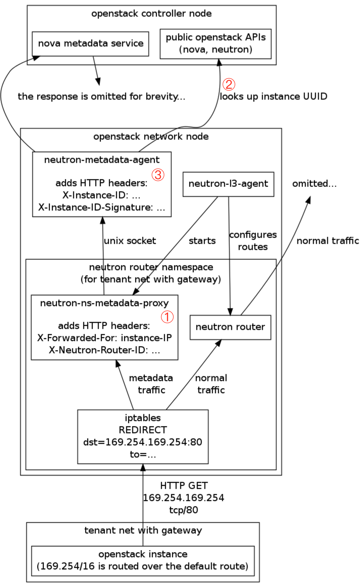

# Metadata là gì và để làm gì?
- Metadata serive là dịch vụ cung cấp cho các instance khả năng lấy thông tin của máy ảo (metadata) từ server thông qua link-local address.

### Vì sao cần metadata
- Vì máy ảo khi được boot lên phải nhận được một số thông tin cấu hình như:
    + IP
    
    + Hostname
    
    + SSH keys
    
    + cloud-init script
    
    + thông tin routing
    
    + ...

### cloud-init là gì?
- Đó là một service cho phép người dùng thực hiện những cấu hình tùy chọn trong thời gian máy ảo được boot lên.

- Cloud-init là một dịch vụ hoàn toàn riêng biệt với metadata service trong OPS. Tuy nhiên nó dùng metadata service để có thể truyền vào máy ảo dữ liệu cấu hình tùy chọn.

### Các cách để đưa cấu hình tùy chọn khi tạo máy ảo
1. Tạo image với tất cả các cấu hình mong muốn
- Cách này không thực tế lắm bởi image được sử dụng cho rất nhiều máy ảo và mỗi máy ảo lại có thể được phục vụ cho một mục đích khác nhau.

2. Cấu hình bằng tay sau khi deploy
- Không thực tế, tốn công sức...

3. Sử dụng metadata service
- Sự không hiệu quả của các cách trên là lí do khiến metadata ra đời. Mỗi khi máy ảo được tạo, nó sẽ yêu cầu metadata service trả lại metadata của nó và cloud-init sẽ hoàn thành những cấu hình tùy chọn theo metadata được lấy về.

### Các loại metadata
- Metadata được chia ra làm 4 loại:
    + Meta-Data: instance-id, account-id, random seed, hostname, etc.

    + User-Data: Thường là cloud-config (một trong những định dạng script của cloud-init dùng để truyền cấu hình mà người dùng muốn vào trong máy ảo)

    + Vendor-Data: Là cách mà các vendor dùng để cung cấp thông tin của họ vào trong máy ảo.

    + Network-Data: bao gồm fixed ip addresses, MAC addresses, port-id's, network-id's, subnet-id's, DNS name-servers, etc.

# 2. Cấu trúc của metadata service

- Đây là sơ đồ miêu tả tổng quan các thành phần trong metadata


## Nova-api-metadata
- Là một sub-service của nova-api, nó chịu trách nhiệm cung cấp metadata, instance có thể gửi request tới REST API của nova-api-metadata để lấy metadata.

- Dịch vụ này chạy trên node controller với port là 8775

- Các bạn có thể thấy ở một số trường hợp nhất định thì nova-api-metadata và nova-api sẽ được kết hợp lại với nhau.

- Để có thể làm như vậy, ta cần khai báo trong file nova.conf
```sh
enabled_apis=osapi_compute,metadata
```

- osapi_compute là dịch vụ của nova-api, metadata là nova-api-metadata service.

## Neutron-metadata-agent

- Máy ảo không thể kết nối trực tiếp tới http://controller_ip:8775 để lấy metadata. Vì thế ta cần tới neutron-metadata-agent. Thông thường dịch vụ này chạy trên node network. Trong một số trường hợp nó cũng có thể chạy trên node controller.

- Instance sẽ gửi request tới neutron-metadata-agent sau đó neutron-metadata-agent sẽ foward nó tới nova-api-metadata

- Thực tế thì máy ảo không thể giao tiếp trực tiếp với neutron-metadata-agent. Vì thế, ta cần tới sự trợ giúp của dhcp agent và l3 agent.

## Neutron-ns-metadata-proxy
- Neutron-ns-metadata-proxy được tạo bởi dhcp agent và l3 agent (nó chạy trên namespace nơi chứa dhcp-agent hoặc router). Neutron-ns-metadata-proxy được kết nối trực tiếp với neutron-metadata-agent thông qua unix domain socket.

# 3. Cách thức hoạt động, luồng đi của metadata trong OPS
- Có thể hình dung đường đi tổng quan của metadata như sau:
    1. Máy ảo gửi request tới neutron-ns-metadata-proxy thông qua neutron network (Project network).

    2. neutron-ns-metadata-proxy gửi request tới neutron-metadata-agent thông qua unix domain socket

    3. neutron-metadata-agent gửi request tới nova-api-metadata thông qua internal management network.

### Sử dụng DHCP agent
- Ngoài L3 agent thì OPS cũng sử dụng cả dhcp agent để tạo và quản lý neutron-ns-metadata-proxy. Để set-up, ta cần chỉnh sử tùy chọn `force_metadata = True` trong file `/etc/neutron/dhcp_agent.ini`.


# 4. Phân tích quá trình nova-api-metadata trả lại metadata cho instance
- Để lấy metadata từ nova-api-metadata, bạn cần phải chỉ ra id của máy ảo. Tuy vậy máy ảo khi mới được boot sẽ không thể biết được id của nó, vì thế http request sẽ không có thông tin về id, nó sẽ được thêm sau bởi neutron-metadata-agent. Ở đây ta thấy sự khác biệt khi sử dụng l3-agent và dhcp-agent.

## 4.1. l3-agent
- Hình dưới đây mô tả cách L3-agent tham gia vào quá trình gửi và nhận metadata request.



- instance -> neutron-ns-metadata-proxy -> neutron-metadata-agent -> nova-api-metadata:

    1. neutron-ns-metadata-proxy nhận request, forward nó tới neutron-metadata-agent trước khi instance ip và router id được add vào request.

    2. neutron-metadata-agent nhận request, nó sẽ check instance id bằng quy trình sau:
        + Thông qua router id để tìm tất cả những subnet connection rồi filter ra instance ip

        + Thông qua subnet để tìm instance ip port phù hợp

        + Thông qua port để tìm instance phù hợp và cả id của nó nữa.

    3. neutron-metadata-agent sẽ add instance id vào http request header rồi sau đó forward nó tới nova-api-metadata. nova-api-metadata lúc này có thể biết instance id để gửi lại metadata phù hợp.

### Cách cấu hình để dùng l3-agent
Cấu hình metadata-agent trong file /etc/neutron/metadata_agent.ini:
```sh
[DEFAULT]
...
auth_url = http://controller:5000/v3
auth_region = RegionOne
admin_tenant_name = service
admin_user = neutron
admin_password = Neutron_pass
metadata_proxy_shared_secret = Metadata3104
nova_metadata_host = 10.2.1.201
nova_metadata_port = 8775
nova_metadata_protocol = http
```

Cấu hình tại file /etc/nova/nova.conf:
```sh
[DEFAULT]
...
service_neutron_metadata_proxy = True
neutron_metadata_proxy_shared_secret = Metadata3104
```

Tại file /etc/neutron/dhcp_agent.ini:
```sh
enable_metadata_network = True

[DEFAULT]
...
enable_isolated_metadata = False
```

Tại file /etc/neutron/l3_agent.ini (Mặc định là cấu hình bên dưới):
```sh
enable_metadata_proxy = true
metadata_port = 9697
```

Sau đó restart dịch vụ để nhận cấu hình

Kiểm tra các router sẽ thấy router namespace sẽ có một iptables rule để redirect traffic tới đích là một metadata server với local port là 9697
```sh
root@tuong-tts-2025-lab-01:~# ip netns exec qrouter-b42a99ba-669e-4b52-a38b-115c9dd5c49b iptables -t nat -L | grep REDIRECT
REDIRECT   tcp  --  anywhere             169.254.169.254      tcp dpt:http redir ports 9697
```


## 4.2. dhcp-agent


1. neutron-ns-metadata-proxy trước khi gửi request sẽ add instance ip và network id vào header của http request

2. neutron-metadata-agent nhận request, nó sẽ check instance id bằng các bước sau:

- Thông qua network id để tìm kiếm tất cả các subnet sau đó filter ra subnet chứa instance bằng instance ip.

- Thông qua subnet tìm kiếm instance ip port phù hợp.

- Thông qua port tìm kiếm ra instance và id của nó.

3. neutron-metadata-agent sẽ add instance id vào http request header rồi sau đó forward nó tới nova-api-metadata. nova-api-metadata lúc này có thể biết instance id để gửi lại metadata phù hợp.

### Cách cấu hình để dùng dhcp-agent
Khi một network không kết nối tới router thì các VM sẽ lấy metadata của nó qua dhcp-agent

Cần cấu hình trong file cấu hình của dhcp agent để set tham số enable_isolated_metadata = true. Và dhcp agent sẽ lắng nghe trên port 80:

```sh
[DEFAULT]
enable_isolated_metadata = True
```

Restart lại dịch vụ, ta sẽ thấy dhcp agent sẽ lắng nghe trên port 80:
```sh
root@tuong-tts-2025-lab-01:~# ip netns exec qdhcp-3f42a6ea-90dd-415e-8129-d6f6b32e1a90 netstat -l | grep http
tcp        0      0 169.254.169.254:http    0.0.0.0:*               LISTEN 
```


